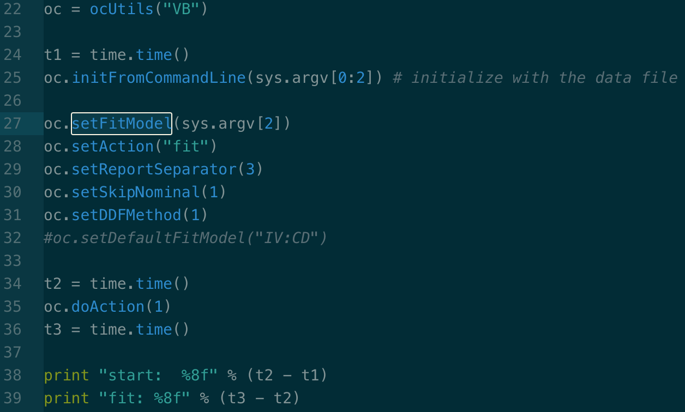

# OCCAM Structural Upgrade - Design Notes
## Introduction and Overview
The current structure of OCCAM appears to date to about 2000 (see the Design Proposal document which contains references to some of the existing core classes). The application design and implementation is not well-documented. This document reflects an initial attempt at providing some transparency on the OCCAM structure, presenting key concepts and considerations of software and system design and engineering, and helping developers new to the project (capstone team members or others) to get oriented without having to spend an excessive amount of time digging through the code (though there's no perfect substitute for spending time with the code). 

To some extent the discussion of design and implementation issues cannot happen without reference to the code. But it should be possible to understand and discuss these issues, at least in a general way, without intimate code familiarity or even knowledge of programming languages. Key concepts of software design and engineering can be discussed without reference to a specific language or implementation platform.  This design overview attempts to provide a helpful view of the current application structure, and approaches to updating it, that can be understood by programmers and non-programmers alike. At the same time, it provides code-specific details which help illuminate the design issues, and will help coding contributors to get oriented.

## Key Concepts of Software Design and Engineering
I wish to highlight a few important principles of software design and engineering that will inform high-level discussion of how to upgrade OCCAM. These are not the only relevant concepts, but they are of primary importance in the discussion of how to proceed with the structural improvements.

"The most fundamental problem in software development is complexity. There is only one basic
way of dealing with complexity: divide and conquer. A problem that can be separated into two
sub-problems that can be handled separately is more than half solved by that separation. This sim-
ple principle can be applied in an amazing variety of ways. In particular, the **use of a module or a
class in the design of systems separates the program into two parts – the implementation and its
users – connected only by an (ideally) well-defined interface**. This is the fundamental approach to
handling the inherent complexity of a program. Similarly, **the process of designing a program can
be broken into distinct activities with (ideally) well-defined interactions between the people
involved.** This is the basic approach to handling the inherent complexity of the development pro-
cess *and the people involved in it.*" (Stroustrop, 693)[emphasis added]

### Modularity
"The scenario is software that consists of thousands or even hundreds of thousands of
lines of code. The complexity of such systems can easily be overwhelming. Some means
of coping with the complexity are essential. In essence, the desire for modularity is
about trying to construct software from pieces that are as independent of each other as
possible. Ideally, each component should be self-contained and have as few references
as possible to other components. This aim has consequences for nearly all stages of soft-
ware development..." (Bell, 67)

### Object-Oriented Design
[Object-oriented design](https://en.wikipedia.org/wiki/Object-oriented_design) "is the process of planning a system of interacting objects for the purpose of solving a software problem." OOD has three key component principles:
* [encapsulation](https://en.wikipedia.org/wiki/Encapsulation_(computer_programming))- "bundling of data with the methods that operate on that data.Encapsulation is used to hide the values or state of a structured data object inside a class, preventing unauthorized parties' direct access to them. Publicly accessible methods are generally provided in the class (so-called getters and setters) to access the values, and other client classes call these methods to retrieve and modify the values within the object."
* [inheritance](https://en.wikipedia.org/wiki/Inheritance_(object-oriented_programming)) - a "mechanism of basing an object or class upon another object (prototype-based inheritance) or class (class-based inheritance), retaining similar implementation"
* [polymorphism](https://en.wikipedia.org/wiki/Polymorphism_(computer_science)) - "the provision of a single interface to entities of different types[1] or the use of a single symbol to represent multiple different types.[2]"

"The advantages of these features is that they promote the reusability of software com-
ponents. Encapsulation allows a class to be reused without knowing how it works – thus
modularity and abstraction are provided. Inheritance allows a class to be reused by
using some of the existing facilities, while adding new facilities in a secure manner.
Polymorphism further promotes encapsulation by allowing general purpose classes to
be written that will work successfully with many different types of object." (Bell, 139)

### Refactoring 
"Refactoring is about improving an architectural design. Nowadays a design tends to be an
OOD, expressed in terms of classes and their interrelationships (methods). However,
design does not usually proceed in a straightforward, linear manner. Most often, design
tends to be an iterative process. First, candidate classes are identified. Then some will be
accepted while others will be rejected – perhaps because they have no methods or because
their methods are subsumed by some other class. Methods tend to migrate from one class
to another as a better understanding of the objects and their role within the problem
emerges. This process is known as refactoring. Refactoring is the transformation of a cor-
rect program structure (e.g., a class diagram) into an improved structure." (Bell, 165)

## Another View: Method (RA) vs. Application (OCCAM)
Another useful way to think about the big picture of design issues is to distinguish between the RA method and the application which implements it. RA provides a number of conceptual tools and practical procedures for analyzing data - that conceptual and practical content can be separated from the implementation - the data handling (I/O), user interface, etc. We are very lucky to have the core RA functionality largely built already (thanks Ken, Heather, Joe, and others!).

This conceptual distinction has important practical consequences. Publishing OCCAM as a python package should give the package user (who might just be using a couple of RA functions in a small notebook, or could be incorporating RA into a much larger application which includes other ML methods, a complex data pipeline, etc.) to core functionality while not enforcing any single way of accessing it (as the implementation currently does). Packaging OCCAM in a modular way will allow users/developers to use that functionality in whatever way works best for them. 

That does not mean that we cannot provide a(n) interface(s). At a minimum, a python package should provide a set of methods which express the full range of RA functions, and therefore make it straightforward to design an interface. If we include, along with that package, a modern, well-designed application interface, then users can immediately begin using RA's powerful analytical methods. A good working paradigm might be:
**Separate core objects and methods from the interface; let the user or app. designer easily create their own interface; provide our own interface to make the application even more accessible** 

Some surgery is needed to disentangle the core RA functionality from the interface. Here's a blog post that provides more detail on interfaces from a software engineering perspective:

[Interfaces: The Most Important Software Engineering Concept](http://blog.robertelder.org/interfaces-most-important-software-engineering-concept/)

## OCCAM Application Structure

### Overview of existing design

OCCAM consists of a core of functionality, implemented in custom C++ classes, which is wrapped in Python (apparently using SWIG, a package which automatically generates the code needed for the wrapping, saving laborious hand-coding of API function calls). The python wrapper consists primarily of ocUtils, a very lightweight helper class which mostly passes parameters to the C++ objects which perform nearly all of the RA computation and generate some/most (though not all) of the output. In some places there is high-level logic (though almost no actual RA computation) handled by python functions - see below under "Python Wrapping" for an example.

This core of functionality can be accessed by two methods: command line (CL) or web interfaces. The command-line files (at install/cl/) are functional, and provide essentially the same output as the web version (without the HTML). The small existing OCCAM user base uses the web version almost exclusively. The CL files are useful for debugging/tracing or otherwise inspecting the behavior of the application, but are not in current use. The web interface, though dated, provides a reasonably good level of functionality (load data; search; fit; examine variable states, predictions, and statistical and info-theoretic measures) for the researchers currently using OCCAM.

The application was designed at a time when web applications were a new frontier, and most of the more modern infrastructure of tools, packages, UIs did not exist. After many years of proprietary development, it is time to update the approach to developing OCCAM to incorporate open-source practices and ideals, modern paradigms of design and implementation, and best available tools, into a structure which will be easier to update and maintain.

### Core Functionality (C++)
The core functionality is reliable and rationally implemented. Implementation in C++ allows computation to be performed very quickly - OCCAM can quickly search a very large space of variables and states, and fit a model once it is selected from search results. Balancing speed (c++) with flexibility/productivity (python) is the primary motivation for this application structure (C++ extensions to python). This guide gives a good overview of the paradigm of extending python with c++: .

[Extending C/C++ with Python](https://medium.com/practo-engineering/execute-python-code-at-the-speed-of-c-extending-python-93e081b53f04)

There are some scattered issues (for example with memory management in the state-based part of OCCAM), but overall the essential RA methods are well-implemented. It is important, in developing OCCAM, that this core analytical functionality be preserved in its current form. There is likely no need, at least in the short term, to redo any significant parts of the RA computation (though the code will definitely need some cleanup and separation of the core functions from the input/output and other components best handled by the user or application programmer).

What is that core functionality (brief overview of workflow/functions)?

* Task selection
* Load Data, with Search Options
* Search and report model results (identify candidate models) (variable- or state-based)
* Fit Model in detail, examine variable relationships and statistical/IT measures. (VB or SB)

(link to separate doc which covers the C++ classes and interfaces)1

Much encapsulation is already provided...

### Python Wrapping
One of the most important structural improvements is, in my view, a partial reworking of the python layer (which handles high-level workflow). This change will touch on nearly every aspect of the updated application, because the design of the extension structure will underlay nearly every other element of the implementation (data handling, UI, integration, etc.). Other improvements, such as the user interface, input/output handling, etc., will follow naturally from that update. The current python layer is very thin, meaning that only a very small of computation is actually being handled by this layer. The python functionality falls into two categories: very high-level workflow, and helpers for c++ objects. Here's an example showing both some very high level workflow, and the use of ocUtils to pass parameters to the c++ objects through the manager:

(from fit.py)

### User Interface
(Find an existing project - and maybe even a design specification - that uses python/c++ in a similar way as an example of what we want this to look like).

## Most Needed Updates

"In both cases, the selection of the parts and the specification of the interfaces between the parts
is where the most experience and taste is required. Such selection is not a simple mechanical pro-
cess but typically requires insights that can be achieved only through a thorough understanding of a
system at suitable levels of abstraction (see §23.4.2, §24.3.1, and §25.3). A myopic view of a pro-
gram or of a software development process often leads to seriously flawed systems. Note also that
for both people and programs, separation is easy. The hard part is to ensure effective
communication between parties on different sides of a barrier without destroying the barrier or sti-
fling the communication necessary to achieve cooperation." (Stroustrop, 694)

### Python Layer
This is in many ways the most important place to focus in the coming weeks and months. The interface between Python/C++, the functionality exposed to the python layer, and the improvements needed to make OCCAM a modern python package that makes RA functionality easy for any Python user to access in a modular and expressive way, are a primary priority in an updated approach to developing OCCAM.

### Input and Output (I/O)

#### Output
Output handling is a good example of the messy entanglement of core RA functions with the interface. In many cases, output is being generated directly in c++: [OCCAM output in c++](https://www.guydcutting.com/images/occam-cpp-output.png)

#### Input (file format and otherwise)
Input data formatting is, in my view, perhaps the biggest obstacle to OCCAM adoption. OCCAM has finally been open-sourced (or the process begun anyway), but it has for years been available in the (proprietary) web format. The current software world moves at the speed of light - someone can install packages with pip or similar tools, combine multiple python libraries, extend python with C++ or other languages, and build a powerful application in a matter of days or hours. Being forced to use a proprietary data format for which we do not have good conversion tools is a major barrier to using OCCAM.

There are many existing data formats which should be suitable for OCCAM, and which can be manipulated using functionality from the python standard library or other packages such as pandas. 

### Caching results (reports and session handling) 
OCCAM employs a hash-based caching mechanism

(references)
