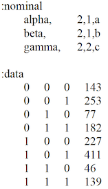
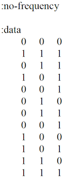
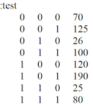
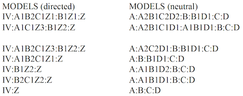
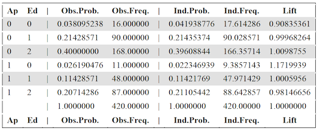
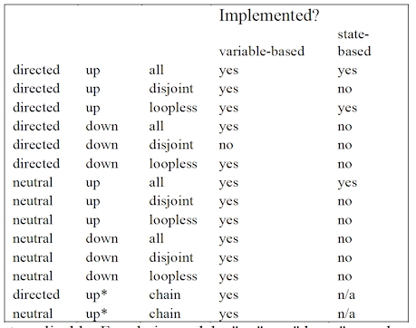
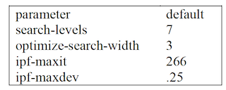
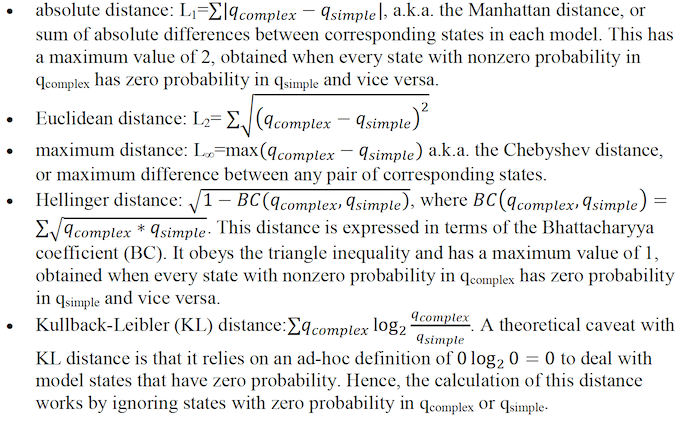

# OCCAM: A Reconstructibility Analysis Program
## (Organizational Complexity Computation and Modeling)
## User Manual

**Project Director: Martin Zwick** zwick@pdx.edu

Past Programmers (most recent first): Forrest Alexander, Joe Fusion, Kenneth Willett

**Systems Science Program Portland State University Portland OR 97207**

**This manual was last revised on 14 November 2018.**

**Occam version 3.4.0, copyright 2006-2017.**

Ken Willett totally rewrote earlier versions of Occam. His version was originally called “Occam3” to distinguish it from these earlier Occam incarnations; the “3” has finally been dropped in this manual.

## Table of Contents

* [I. For Information on Reconstructability Analysis](#i-for-information-on-reconstructability-analysis)
* [II. Accessing Occam](#ii-accessing-occam)
* [III. Search Input](#iii-search-input)
* [IV. Search Output](#iv-search-output)
* [V. State-Based Search](#v-state-based-search)
* [VII. Fit Output](#vii-fit-output)
* [VIII. State-Based Fit](#viii-state-based-fit)
* [IX. Show Log](#ix-show-log)
* [X. Manage Jobs](#x-manage-jobs)
* [XI. Frequently Asked Questions](#xi-frequently-asked-questions)
* [XII. Error And Warning Messages](#xii-error-and-warning-messages)
* [XIII. Known Bugs &amp; Infelicities; Limitations](#xiii-known-bugs--infelicities-limitations)
* [XIV. Planned But Not-Yet-Implemented Features](#xiv-planned-but-not-yet-implemented-features)
* [Appendix 1. Rebinning (Recoding)](#appendix-1-rebinning-recoding)
* [Appendix 2. Missing Values in the Data](#appendix-2-missing-values-in-the-data)
* [Appendix 3. Additional Parameters in the Input File](#appendix-3-additional-parameters-in-the-input-file)
* [Appendix 4. Zipping the Input File](#appendix-4-zipping-the-input-file)
* [Appendix 5. Compare Mode](#appendix-5-compare-mode)
* [Appendix 6. Cached Data Mode](#appendix-6-cached-data-mode)

## I. For Information on Reconstructability Analysis
For papers on Reconstructability Analysis, see the Discrete Multivariate Modeling (DMM) page at http://www.pdx.edu/sysc/research-discrete-multivariate-modeling. For an overview of RA, see the following two papers that are on the DMM page:

“Wholes and Parts in General Systems Methodology” at http://www.sysc.pdx.edu/download/papers/wholesg.pdf

“An Overview of Reconstructability Analysis” at http://www.sysc.pdx.edu/download/papers/ldlpitf.pdf

## II. Accessing Occam

***Occam location & general use*** Occam is at: http://dmit.sysc.pdx.edu/. It can also be accessed from the DMM web page:

Occam runs on a PSU server. The user uploads a data file to this server, provides input information on a web input page, and then initiates Occam action. When the computation is complete, Occam either returns HTML output directly to the user or a .csv output file that can be read by a spreadsheet program such as Excel. If the computation is not likely to finish rapidly, the user can provide an email address and Occam will email the output (in .csv form) to the user when it is done.

***Notify us of program bugs & manual obscurities/errors*** If you encounter any bugs or mysterious output, please check to see that your input file matches the format requirements specified below. If you are confident that your input file is formatted correctly, email it to us at: Occam-feedback@lists.pdx.edu. Please include the settings used on the web page, a description of the problem, and the Occam output if available. (If your input file is large, please zip it before attaching to your email.)

We also need your support in maintaining this user’s manual. Please let us know if there is information missing in this manual that you need, if explanations are obscure, or if you see any errors. Email your comments to: Occam-feedback@lists.pdx.edu.

***Action*** When one brings Occam up, one first must choose between several Occam *actions*. The modeling options are: “Do Fit,” “Do Search,” “Do SB-Fit,” and “Do SB-Search.” There are also options for “Show Log” and “Manage Jobs,” which allow the user to track the status of jobs submitted for background processing. You can see this first web page by clicking on: http://dmit.sysc.pdx.edu/weboccam.cgi.

There is one additional available action, “Do Compare”, which is a specialized tool for doing pairwise comparisons between related datasets (explained in the Appendix). Finally, for any of the Search and Fit actions, there is a checkbox for “Cached Data Mode”, which allows the separate uploading of the parts of the Occam input file: the variable block, the (training) data block, and (optionally) the test data block for the dataset (explained in the Appendix).

When an option is selected, Occam returns a window specific to the choice made. **Search** assesses *many models* either from the full set of all possible models or from various partial subsets of models. **Fit** examines *one model* in detail. In an exploratory mode, one would do **Search** first, and then **Fit**, but in a confirmatory mode, one would simply do **Fit**. The options for **SB-Fit** and **SB-Search** function similarly, but for *state-based models*, rather than the default variable-based models. Let’s focus first on the main option of “Do Search.”

## III. Search Input
On the first line, the user specifies a data file, which describes the variables used and provides the data to be analyzed. The data file allows the user to set certain parameters, but parameters should be specified on the Occam web input page, since parameters set on the web page override any in the data file. The only parameters that currently can be specified *only* in the data file are the two parameters that govern the iterative method, IPF, used in Occam. These should be modified only if there is reason to believe that IPF is not converging properly; see Appendix 3 for further information. (The capacity to specify parameters in the data file is designed for command line use of Occam within a Unix environment; such use of Occam is not currently functional, but may be restored to functionality in the future.) The data file will now be discussed, and then the other parameters on this web input page will be explained.

***Data file*** The user must specify a data file on the user’s computer by typing its name (and location) in or finding it by browsing. The data file is then uploaded to the Occam server. This is actually all that is needed to submit an Occam job, if the user is satisfied with the default setting of all the parameters.

Data files should be plain-text ASCII files, such as those generated by Notepad, Word, or Excel if the file is saved in a .txt format. (Note that in Excel, you should *not* use the “Space Delimited Text” format, with the .prn extension, as it can be incompatible with Occam.) Each line of the data file has a maximum length, currently set to 1000 characters. Occam will give an error if this is exceeded. If your data set requires lines longer than this limit, please contact the feedback address listed above.

A minimal data file looks like (data from the “Wholes & Parts” paper):



This simple file has 2 parts: (1) specification of the variables (the ‘variable block’), and (2) the data to be analyzed (the ‘data block’). Each part in this example begins with a line of the form “:parameter”, where “parameter” is “nominal”, or “data”.

**Variable specification** Variable specification begins with “:nominal” which reminds the user that nominal (categorical, qualitative) variables must be used. (For tips on binning quantitative variables, see FAQ \#6.) After “:nominal”, the variables are specified, one per line. White space between values is ignored. In the above example, the first line is:

```
alpha, 2,1,a
```

“alpha” is the name of the first variable. The second field indicates that it has 2 possible states (a “cardinality” of 2). The third field (shown above as 1) is 0, 1 or 2. A value of 1 defines the variable as an “independent variable” (IV) or input. A value of 2 defines it as a “dependent variable” (DV) or output. A value of 0 means that the variable (and the corresponding column in the data) will be ignored. This allows the user to have data for more variables than can be analyzed at any one time; the user could then easily alter which variables are to be included in the analysis and which are to be omitted. If the value in the third field is 0, any rebinning string (described below in Appendix-1) will be ignored. If all variables are designated as IVs (1) or as DVs (2), the system is “neutral.” If some variables are IVs, and one is a DV, the system is “directed.” At present, only one variable can be a DV. Occam cannot analyze multiple DVs simultaneously; they must be analyzed separately one at a time. The above data file is for a directed system. A useful but not obligatory convention (it is in fact not followed in the above input file) is to give the DV the short name “Z”, and name all the IVs from the beginning of the alphabet.

The fourth field is a variable abbreviation, ideally and most simply one letter. Lower case letters may be used, but will appear in Occam output with the first letter capitalized. In

the above example, variable “alpha” will be referred to in Occam output as “A”. If there are more than 26 variables, one can use double (or triple, etc.) letters as abbreviations, for example “aa” or “ab”. Such variables would appear in model names as AaB:AbC, for example. The capital letters help one to see the variables as separate. If State-based Search or Fit will be used, variable abbreviations must be only *letters*. Numbers (e.g., A2) or other symbols may *not* be used to abbreviate variables, since numbers are reserved for use as the names of specific states in State-Based RA. However, if you are *sure* that you will not be using State-Based Search or State-Based Fit, you may use numbers in your variable names.

Although data submitted to Occam must already have been binned (discretized), an optional fifth field tells Occam to “rebin” the data. Rebinning allows one to recode the bins by selecting only certain bin values for consideration or for omission, or by aggregating two or more bins. This is discussed in depth in Appendix-1.

**Data specification** The second part of this file is the data, which follows the “:data” line. In the data, variables are columns, separated by one or more spaces or tabs. The columns from left to right correspond to the sequence of variables specified above, i.e., the first column is alpha, the second beta, and the third gamma. Following the variable columns there can be an additional column that gives the frequency of occurrence of the particular state specified by the variable values. The frequency value does not have to be integer, so frequencies that become non-integer because some weighting has been applied to them are OK. However, frequency values may not be negative.

Note that since non-integer frequencies are allowed, one can use Occam to analyze–and compress–*arbitrary functions* of nominal variables. Occam simply scales the function value so that it can be treated as a probability value, and then does a decomposition analysis on this pseudo-probability distribution. In the work of Bush Jones, this is called “g-to-k” normalization. However, if Occam is used in this way, statistical measures that depend on sample size (e.g., Alpha, dLR, BIC, AIC) do not have their usual meaning. This use of Occam, and two other approaches to continuous DVs, is documented in the paper “Reconstructability of Epistatic Functions” available from the DMM page.

Since variables are nominal, their values (states) are *names*. Normally, these will be 0,1,2... or 1,2,3... but the character “.” is to be used to designate missing values. When using “.” it must be included in the cardinality of the variable; that is, if the variable has 3 possible values, but a value is sometimes also missing, the cardinality of the variable is 4. *No other non-numeric characters are allowed as variable states*. To avoid confusion, it is best to start the labeling of *all* variables either with 0 or with 1, i.e., it is best not to start one variable with 0 and another with 1 (though Occam can handle such inconsistencies of convention). The user should know the number of different states that occur for each variable and indicate the cardinality of the variable correctly in the variable specification.

Data can be provided to Occam *without frequencies*, where each line (row) represents a single *case*. The rows do not have to be ordered in any particular way. Occam will generate the frequencies itself, but it needs to be told that the data do not include frequencies, as follows:



Uploading data will be faster if the data provides frequencies, so if the data file is big, the user might consider doing this operation before calling Occam.

**Test data specification** Optionally, a data file can include “test data.” Typically, test data are a fraction of the original data that has been set aside, so that models can be measured against data that were not used in their creation. In Search, if test data are present and the “Percent Correct” option is checked, the report will include the performance of the models on the test data. In Fit, the performance of the model on test data is shown automatically, whenever test data are present. To include test data in a data file, use the “:test” parameter, followed by lines of data in the same format used for “:data”.


**Comments in the data file** A line beginning with “\#” will be ignored when Occam reads the data file, so this character can be used to begin comment lines. Also on any given line, Occam will not
read past a “\#” character, so comments can be added at the end of lines which provide actual input to the program. Comments do not count toward the maximum line length mentioned above.

***Web input*** We now discuss the other parts of the Search web input page.

***General settings ***

**Starting Model** Occam searches from a starting model. This can be specified on the browser page as “Top” (the data or “saturated model”), “Bottom” (the independence model), or some structure other than the top or bottom, e.g., “AB:BC”. (Lower case “top” and “bottom” are also OK.) This field can also be omitted, in which case Occam uses the starting model specified in the data file (after the variable specification and before the data), as follows:

:short-model AB:BC

(“Short” refers to the variable abbreviations.) If the data file also does not specify a starting model, Occam uses the default starting model, which for both directed and neutral systems is “Bottom.” Note that when working with a directed system, the component containing all the IVs can be abbreviated as “IV” if it is the first component in the model. That is, “IV:ABZ:CZ” is acceptable as a starting model. This same notation is used in the Search output for a directed system. Similarly, in neutral systems, the abbreviation “IVI” can be used as the first component of a model; it represents all of the single-variable components. (“IVI” stands for “individual variables independently.”) For a 5-variable neutral system, the independence model of “A:B:C:D:E” could be written simply as “IVI”, and a more complex model such as “A:B:C:DE” could be written as “IVI:DE”. This notation also appears in Search output. Both notations are especially useful when modeling data with many variables. The rationale for this is that we’re interested in associations between variables, and don’t see all the variables not currently associated with any other variable.

**Reference Model** Assessing the quality of a model involves comparing it to a reference model, often either Top or Bottom. If the reference model specified in the browser page is left as default, it will be “bottom” for both directed and neutral systems (the same as the convention for the starting model). If the reference model is Top one is asking if it is reasonable to represent the data by a simpler model. If the reference model is Bottom one is asking whether the data justifies a model more complex than the independence model.

The reference model can be the starting model. When the starting model is neither Top nor Bottom, this can be used to determine whether “incremental” changes from the starting model are acceptable, as opposed to whether “cumulative” changes from the top or bottom are acceptable. The starting model may be a good model obtained in a prior
search, and one may now be investigating whether it can be improved upon. At present, if the reference model is chosen to be the starting model, the starting model must be entered explicitly on the browser input page; Occam will not pick it up from the data file.

**Models to Consider** Occam offers a choice between (a) all, (b) loopless, (c) disjoint, and (d) chain models.

**a. All models** “All” means there are no restrictions on the type of model to be considered. One controls the extent of this search with parameters “Search Width” and “Search Levels,” both of which are specified on the web page. Their current default values are 3 and 7, respectively, which are modest settings for beginning a search. Occam generates all “parents” of a model if search direction is “up” or all “children” if search direction is “down”. It then retains the best “Search Width” number of models, where best is determined by the parameter “During Search, Sort By,” whose default setting is “dBIC.” (At the starting level, there is only one model, but at subsequent levels there will always be “Search Width” models.)

**b. Loopless models** Loopless models are a subset of the full Lattice of Structures. For example, AB:BC is loopless, but AB:BC:AC has a loop, and would not be included in a loopless search. Doing a loopless search will be faster than an “all” search for two reasons: (1) the iterative procedure (Iterative Proportional Fitting, or IPF) used to generate model probabilities converges in a single cycle for loopless models, but requires several and possibly many cycles for models with loops, and (2) the lattice of loopless models is smaller than the full lattice.

An important use of a loopless search is for variable screening (also known as feature selection or dimensionality reduction) in directed systems. In a directed system, all models have one component that includes all the IVs, and all other components include the DV. (At present, Occam cannot consider multiple DVs.) Call a component that includes a DV a “predicting component”; these are shown in bold in this paragraph and the next. A *single-predicting-component* (SPC) model, e.g., AB:**AZ**, will never have a loop, but *multiple-predicting-component* (MPC) models, e.g., AB:**AZ**:**BZ**, will always have loops. So a loopless search looks only at SPC models. This is valuable for screening IVs, i.e., for eliminating IVs that don’t impact the DV(s) very much. Suppose one had 100 IVs and 1 DV, and wanted to find out which of the 100 IVs has predictive value for the DV. A loopless search will provide this information.

For a loopless search, “Search Levels” determines how many IVs will be in the SPC, and “Search Width” determines how many such models are considered at each level. To illustrate: suppose one has four IVs, A,B,C,D, and one DV, Z, and one starts the search at the bottom. If “Search Width” is 2 and “Search Levels” is 3, then at the first search level Occam generates all parents of ABCD:**Z**, i.e., all one-IV SPC models: ABCD:**AZ**, ABCD:**BZ**, ABCD:**CZ**, ABCD:**DZ**. On the basis of the Sort parameter specified in the browser input page, Occam then picks the best 2 of these, say ABCD:**BZ** and ABCD:**DZ**.

Then, at the second search level, all parents of these 2 models are considered. These will include predicting components of **ABZ**, **CBZ**, **DBZ**, and **ADZ**, **BDZ**, **CDZ**. The best 2 of these 5 models will be retained. Say these are ABCD:**ABZ** and ABCD:**BDZ**. Occam then examines, at the third search level, all parents of these models, and again keeps the best 2.

If one wants to do an *exhaustive* search of *all* SPC models with a certain number of IVs in the predicting component, one needs to set the width parameter high enough. For problems with many variables, if the number of IV predictors one wants to consider is high, this may be impractical. A *heuristic* selection of good SPC models may then have to be done, using reasonable values of “Search Width” and “Search Levels.”

In neutral systems, one might want to consider doing a run with width very high to get a list of associations, ordered by their strength, as assessed by dBIC, dAIC, or Information, or by their significance, as assessed by Alpha (p-value).

**c. Disjoint models** “Disjoint” means non-overlapping; that is, any two components of a model do not overlap in their variables. For neutral systems, the idea of a disjoint model is straightforward. A disjoint model search would reveal what are the best “cuts” of a system into non-overlapping subsystems, e.g., for a 4-variable system, AB:CD or AC:B:D. Such a search could also be used as a rough search, after which one might do a downward search relaxing the constraint of disjointness.

For directed systems, the notion of a disjoint model is not as straightforward. Only the independence model and the saturated model are disjoint in a strict sense. For example, in a four-variable directed system with A,B,C as IVs and Z as the DV, every model must have an ABC component, so only ABC:Z and ABCZ are disjoint. What one is really interested in here is the disjointness of the *IVs in the predicting components*. A disjoint model, for a directed system, will thus be defined to mean that there is no overlap in the IVs of any two predicting components. That is, the influence of subsets of the IVs on the DV is separable, and has no interaction effects. For example, directed system ABC:**A**Z:**B**Z is disjoint, but directed system ABC:**AB**Z:**BC**Z is not. Note that if ABC:AZ:BZ were a neutral system, it would *not* be considered disjoint.

In summary, for neutral systems, disjoint models partition all the variables into non- overlapping subsets. For directed systems (with one DV), disjoint models partition all the IVs which affect the DV into non-overlapping subsets.

**d. Chain models** AB:BC:CD:DE illustrates the idea of a chain model. All components have two variables, and every component, except for the ends, overlaps the component to the left with one variable and the component to the right with the other. Chain model searches are not searches in the sense of starting with a model and going either up or down the lattice. Occam simply generates and evaluates all chain models. Chain models have been used for studies on the use of RA to prestructure genetic algorithm genomes. One could compare all lineal causal chains, of form A → B → C → D, by using chain models.

**Search Direction** The default direction is up for both directed and neutral systems. For some purposes one might wish to do downward searches. The Search Direction should not be confused with the Reference Model. Model assessments depend on the Reference Model, not on the Search Direction.

**During Search, Sort By** The browser page offers a choice of sorting by Information, Alpha, % Correct, dBIC or dAIC. This criterion determines the best “Search Width” models at every level to be retained for going to the next level.

Information is constraint captured in a model, normalized to a range of 0 to 1. It is linear - with uncertainty (Shannon entropy), likelihood-ratio Chi-square, and %-reduction of uncertainty (for directed systems with one DV), so sorting on information is *equivalent* to sorting on one of these parameters.

Alpha is obtained from Chi-square tables using the likelihood-ratio Chi-square and dDF (delta-degrees of freedom) as inputs. It is the probability of a Type I error, namely the probability of being in error if one rejects the null hypothesis that a model is really the same as the reference model. Note that if the reference model is “Bottom,” a model is good, in the sense of being statistically different from the independence model, if Alpha is *low*, so the “standard” cut-off of 0.05 could be used. If the reference model is Top, a model is good, in the sense of being statistically the same as the data, if Alpha is *high*, so the standard 0.05 makes no sense. However, we don’t want Alpha to be too high, or the model will be too complex. In one log-linear book, an Alpha of .1 to .35 is recommended, but the choice of Alpha really depends on the user’s purposes. The fact that the standard of 0.05 makes sense for Bottom as reference but doesn’t make sense for Top as reference is one of the reasons that the default reference model in Occam is Bottom for both directed and neutral systems.

The currently recommended choice is to sort by dBIC, since the currently recommended criterion for the ‘best model’ among the three best models offered by the summary output of Occam for directed systems is dBIC; see the section, “Search Output: Output for a directed system” below. BIC is conservative; it penalizes models for their complexity more than the other criteria considered by Occam, and it thus favors models which includes only the strongest, and thus the most reliable, associations.

**When Searching, Prefer** At every level Occam chooses the best “Search Width” out of a set of candidate models by using the sorting criterion. When this criterion is Information, one obviously prefers Larger Values, but when the sort criterion is Alpha, one might prefer *either* “Larger Values” (if the reference model is Top and one cares a great deal about fidelity to the data) or “Smaller Values” (if the reference model is Bottom and one cares a great deal about the statistical justifiability of complex models).

**Alpha Threshold** This applies only to searches sorted by information, which uses incremental alpha to limit the search. Alpha Threshold is the maximum value of Incremental Alpha allowed when considering a search step from a ‘progenitor’ model to a new model. Incremental alpha is the chi-square p-value assessing the statistical significance of the difference between these two models. With the default (standard) value of this parameter, the search is limited to models with a chi-square p-value of less than 0.05. For searches with the independence (or some other simple) model as the reference, typically done upwards to models with greater complexity, low values of the threshold result in a more restrictive search and high values result in a more permissive search. For searches with the data (or other complex) model as the reference and typically done downwards to models with greater simplicity, the opposite holds: low values of the threshold are restrictive and high values are permissive. Upwards searches are recommended unless there is a specific reason to do a downwards search.

**Search Width** This is the number of the best models to retain at every level. If the value is specified it overrides any value specified in the data file. If the value is omitted, the value in the data file is used, and if it also does not specify a value, the default value of 3 is used.

**Search Levels** This is the number of levels to be searched, *including* the starting model. If the value is specified it overrides any value specified in the data file. If the value is omitted, the value in the data file is used, and if it also does not specify a value, the default of 7 is used.

***Report settings ***

**In Report, Sort By:** Output can be sorted by (a) Information, (b) Alpha, (c) dDF, (d) Level, (e) % Correct, (f) dBIC, and (g) dAIC. (NB: the measure used to sort the Occam output report need not be the same as the measure used to sort during the search process.) dDF is the change of degrees of freedom relative to the reference model. Sorting by levels allows the user to have output which truly follows the order of the Lattice of Structures; this is not actually accomplished by sorting on dDF, because different variable cardinalities can result in a model at a lower level still having a higher dDF than a model at a higher level.

**In Report, Sort:** Occam output can be printed in either (a) Descending or (b) Ascending order of the magnitudes of the sorting measure. For example, if the report is sorted on Information in a descending order, then the most complex, high information, models will appear in the output at the top of the page.

**Include in Report:** Many of the search criteria and other output measures can be turned on or off as desired. A standard set is turned on by default. Some of these options are described below.

**Include in Report: Incremental Alpha** When selecting this option, the Search report includes the statistical significance of each step through the lattice. This provides another method for selecting the best model in a Search. Two columns are added to the report: "Inc.Alpha" and "Prog." The first of these columns lists the (incremental) chi-square alpha between the model and the ‘progenitor’ model from which it was derived. When searching up from the bottom, the progenitor will be a model lower on the lattice; when searching down from Top, it will be a model higher on the lattice. The “Prog.” column lists the row ID of the progenitor. When there are multiple progenitors—multiple ways to reach the model in the search—the listed progenitor is one with the best incremental alpha. When searching from the bottom, smaller alpha values are preferred; from the top, larger. A typical way to use this feature is in a Search up from the bottom. When selecting a best model, such as by highest information value, you might select one where every step also has an alpha less than the Alpha Threshold (default 0.05). To assist in this, each model that is “reachable” (that is, where every step has alpha less than the threshold) is marked by an asterisk in the ID column.

**Include in Report: Percent Correct** If checked, Occam will add Percent Correct to the measures outputted. This is a measure of model goodness very different from information or amount of uncertainty reduced. It is relevant where one wishes to predict from the values of the independent variables what the value will be for the dependent variable. Percent Correct is defined as (1/N) ∑~k\ N(\ k,\ jmax(k)\ ),\ where\ N\ is\ the\ sample\ size,\ k\ is\ an\ index\ which\ runs\ over\ IV~ states, j is an index which runs over DV states, N(k,j) is the number of cases having IV~k\ and\ DVj,\ jmax\ is\ the\ j\ which\ gives\ the\ highest\ calculated\ probability,\ q(DVj\ |\ IVk),\ for\ the~ model under consideration. If test data are included in the input file, Percent Correct will also be displayed for them..

**Include in Report: % Coverage of Data** This option measures what portion of the IV state space of a model is present in the data. For example, if all possible combinations of a model’s IV states are present in the data table, the model has 100% cover. This can be useful for determining which models are based on a small sample of their state space. This statistic is relevant only for Directed models, and appears in the results in a column labeled “%cover.” Because of the way it is computed, %Correct will always be included along with it in results.

**Include in Report: % Missing in Test** This option measures what portion of the Test data was not present in the Training data, for each model. That is, relative to the IVs present in a model, it measures what percent of the Test data cases have IV state combinations that were not seen in training. This measure will typically have a lower value at the bottom of the lattice, increasing as you move up the lattice of models. This is especially pronounced when your data represent a small portion of the state space. It is only available for Directed models, and only when Test data are present. It shows up in the Search report in a column labeled “%miss.”

**Return Data in Spreadsheet Format** If this is selected, Occam returns its output as a .csv (comma separated columns) file, where the first name of the file is the first name of the input file. The .csv format is one of the standard input formats for spreadsheet applications (like Excel), so one can open it directly in such a program and see the Occam output as a spreadsheet for further processing. (If the web browser asks the user to either open or save the .csv file, it is suggested that the user save the file and open it manually, or risk losing the output.)

**Print Option Settings** When selected (which is the default), Occam echoes the parameter settings that have been specified in both the browser input page and the data file before it displays the actual output of the Occam run. This allows the user to document what data file and parameter settings produced the Occam output. An associated option, “but don't print variable definitions,” allows the user to suppress the output of variable information as specified in the data file. This can be used to reduce clutter when working with many variables.

**Use Inverse Notation for Models** When this option is enabled, model names in the report will be printed with an alternate notation, showing only the variables that are *not included* in each model. Omitted variables are shown in square brackets. For example, for IVs A, B, C, D, E, the directed model "IV:ABCEZ" is displayed as "IV:\[D\]Z". The neutral model "ABC:BCD:ABD" is displayed as "\[D\]:\[A\]:\[C\]". This notation can be more concise and understandable, particularly near the top of the lattice. This notation is also useful in particular applications, such as when a researcher needs to compare a pair of models like "IV:AZ" and "IV:\[A\]Z". Occam output for the model IV:AZ, with the reference being IV:Z, gives the reduction of uncertainty of Z, given A; this is equivalent to T(A:Z), the transmission (the strength of association, the mutual information) of A and Z. Suppose one wants to evaluate the association between A and Z, *controlling for B, C, D, and E*. This is given by T~BCDE(A:Z)\ =\ T(ABCDE:BCDEZ)\ =\ T(IV:\[A\]Z);\ this\ quantity\ is\ reported\ by\ Occam\ as~ the reduction of uncertainty for model IV:\[A\]Z. The difference between this uncertainty reduction and the uncertainty reduction of IV:AZ is precisely the uncertainty reduction of Z, given A, controlling for BCDE.

Inverse notation can also be used to specify the Starting Model in a Search, whether or not the “Use inverse notation” option is selected for the report.

**Run in Background, Email Results To:** For jobs that are likely to take too long to wait for immediate browser output, type in your email address, and Occam will email the results to you in spreadsheet format.

You can check the status of your job by choosing **Show Log** on the main Occam page and typing in your email address. The log contains *two lines* for every job submitted for background running. When the job is submitted, the log adds the line “*Job started: *

*data/filename*.” When the results are emailed to the user, a second line is added: “*Results for data/filename sent to username@emailaddress*.”

**Subject line for email (optional):** When using the “Run in Background” option, you may optionally specify a subject line for the resulting email. This can be used to easily differentiate between multiple runs with the same data set, for instance, by placing the search options used into the subject line.

**Send** This sends the browser page to the Occam server. Occam will return its output in a new window. This makes it easy for the user to change parameter settings on the browser input page, and resubmit.

When jobs are submitted to run in the background, the browser will first say: “*Batch job started*.” When the data file has been read in, and the background job has been started, the browser will add: “*data file: filename, received from username@emailaddress*”. Do not close this browser window until after you see this second line appear.

## IV. Search Output
If “Print options settings” has been selected, the Occam output will begin by echoing the parameter settings from the web input page and from the data file. Occam also outputs the values of “Search Levels” and “Search Width,” even if these have not been explicitly specified in the data file; this tells the user what the default values currently are.

Occam will always print out, as it goes from level to level, how many models are generated at each level and how many of these are kept. This lets the user track the progress of Occam. It also shows whether an exhaustive search is being done (all models generated are kept) or only a partial (heuristic) search is being done (only some generated models are kept, i.e., the lattice is being pruned). It also informs the user about memory used in the computation.

***Output for a directed system*** Below is a sample output of a directed system with Z as the DV and the other variables as IVs. (This is data from the Kramer et al 2012 study on Alzheimer Disease; a paper, given at Kobe, Japan, on this study can be downloaded from the DMM web page.) The output has been sorted on Information. Values in tables output by Occam are rounded to four digits after the decimal. However, to make the example shown here fit on the page, the values were rounded to two digits after the decimal. The lower case “d” in dDF, dLR, %dH(DV), dAIC, and dBIC means “delta” (i.e., it is a difference from the reference model).


• The **ID** column gives a unique ID number for each row. This number can be used to refer to a particular row in the output, when Model names are too cumbersome.

• In the **Model** column, “IV” stands for a component with all the IVs in it

• **Level** is the level of the search, relative to the starting model.

• **H** is information-theoretic uncertainty (Shannon entropy).

• **dDF** is *delta*-Degrees of Freedom, the difference in DF between the model and the reference model. The value is calculated as DF(upper model) – DF(lower model), relative to the lattice, so it is always a positive value. That is, DF is always highest for Top, and lowest for Bottom. The model for which dDF=0 is the reference model.

• **dLR** is the *delta*-Likelihood-Ratio chi-square (sometimes written as L^2^), which is the error between a model and the reference model. As is customary in statistics, it is calculated as LR(lower model) – LR(upper model), and so will always be positive. (LR is highest for Bottom, and lowest for Top.) LR is calculated as 2\*ln(2)\*N\*T, where N is sample size and T is transmission.

• **Alpha** is the probability of making a Type I error; that is, the probability of being in error if one rejects the null hypothesis that the model is the same as the reference model.

• **Inf** is Information, the amount of constraint in the data that is captured in a model, normalized to the range \[0,1\]. Inf = \[T(Bottom) – T(model)\] / T(Bottom) = \[H(Bottom) – H(model) / H(Bottom), where T is transmission (Kullback-Leibler distance). Inf is always 1.0 for Top, and 0.0 for Bottom.

• **%dH(DV)** is the percent reduction in uncertainty of the DV, given the IVs in the predicting components. While Information is a standardized measure, scaled from 0 to 1, so it tells the user how much of the constraint in the data is captured in the model. %dH(DV) is the actual reduction of uncertainty achieved by any model. A model could capture all (100%) of

the constraint in the data, but this constraint might only minimally reduce the uncertainty of the DV. That is, Information is a relative number; %dH is an absolute number. But these two measures (and H and dLR) are linearly related: %dH(DV) = Information \* %dH(DV) for the top (saturated) model. For more information on these measures, see the “Wholes and Parts” and “Overview of Reconstructability Analysis” papers mentioned above.

• **dAIC** and **dBIC** are differences in the Akaike Information Criterion and the Bayesian Information Criterion. dAIC is calculated as AIC(reference model) – AIC(model), and similarly for dBIC. AIC and BIC are measures of model goodness that integrate error and complexity and that do not require–as does Alpha–that the models being compared are hierarchically related. A “best” model is the one having a *minimum* AIC (or BIC) value, and hence a *maximum* dAIC (or dBIC) value. This means that, when using dAIC or dBIC to select a model, the highest positive value is preferred. This is true regardless of whether Top or Bottom is chosen as the reference.

• **Inc. Alpha** is the Incremental Alpha between the model and its progenitor, given in the next column **Prog.** This is the chi-square p-value between the model distribution and the progenitor model distribution. When this value is low, the two models have similar distributions.

• If you selected “Add to Report: Percent Correct,” the report will also contain a column labeled **%C(Data)**, showing the performance of each model on the given data, and a column labeled **%cover** giving the coverage of data, the portion of the state space of the IVs *in the predicting relations* of the model (not *all* the IVs, which are collected together in the “IV” relation) that is present in the data. If your input file included test data, a second column labeled **%C(Test)** is included, showing the performance of each model on that data, and a column labeled **%miss** giving the portion of the predicting IV states that occur in the test data that were not seen during training. (The model thus has no basis to make predictions for these IV states).

Note that Level depends on the choice of starting model, while dDF, dLR, Alpha, dAIC, and dBIC depend on the choice of reference model. Values for H, Information, and %dH(DV) are “absolute” and do not depend on starting or reference model.

At the end of the Search output, after the list of models found during the search (the number of these models is width\*levels), the best of these models are summarized. These include the models with the best (highest) values of dBIC and dAIC. (Lower absolute values of BIC and AIC are normally preferred, but Occam reports these measures as differences between a reference and a model, and for such differences, higher values are better.) There may be more than one such model if there is a tie between models for best score. Similarly, the best model by Information is reported, considering – for Bottom as reference and searching upwards – only models that can be reached from the starting model with Incremental Alpha less than the Alpha Threshold (default 0.05) at each step.

of increasing complexity. Also, note that the models with Incremental Alpha less than Alpha Threshold at each step are marked with a \* next to their name in the search report.

The user should normally select a model from among these summary best models. Choice of the dBIC-best model is nearly always a conservative choice: in upwards searches with independence as the reference, the dBIC-best model will usually be less complex than the dAIC-best or Information-best (Incremental Alpha-best) models. This dBIC model will often ‘underfit,’ i.e., it will be less complex and thus less predictive than what is statistically warranted. The best dAIC and Incremental Alpha (at the 0.05 default) models, however, will usually ‘overfit,’ i.e., they will be more complex than what is statistically warranted, although in some cases (e.g., when sample sizes are large), these models may not over-fit and thus may be preferred. Thus, dBIC and the other two criteria usually bracket the ‘sweet spot,’ i.e., the model complexity that is optimal for generalization to new data. Since underfitting is normally considered (by statisticians) as not as bad as overfitting, choosing a model based on dBIC is recommended.

Finally, if test data was included in the input file, Occam will also report the best model by accuracy (%C) on the test dataset. This is potentially useful for evaluating how well a model chosen by *another* score (dBIC, dAIC, or Information) does on the test set, and this can be valuable for research on RA methodology. However, %C(test) may not be used as a method of *selecting* a model in data analysis projects. The purpose of test data is to validate a model selected by other criteria, and thus test data must not be involved in any way, even indirectly, in model selection. (However, if the test data given to Occam is really *pseudo*-test data – also known as cross-validation data – and the user has held out real test data to be used later to assess the selected model, then using this pseudo-test data to select a model is OK.)

***Output for a neutral system ***


Using the same data file (from the “Wholes and Parts” paper) as shown above in the Data files section of **III. Search Input**, if C is regarded as an IV along with A and B, then the system is neutral. Below are the measures for the lattice of neutral systems. Note that the column for uncertainty reduction is omitted because there are no DVs. Values in the table are rounded to four digits after the decimal.

## V. State-Based Search
The differences between state-based RA and variable-based RA are too lengthy to describe here. For a better description, see the paper, “State-Based Reconstructability Analysis” at http://www.sysc.pdx.edu/download/papers/mjpitf.pdf.

In the operation of Occam, the main difference for the user is that state-based RA will consider many more models than variable-based RA, for a typical input file. This is caused by the finer granularity of the Lattice of Structures. For instance, in an all-models search, each step will have a dDF of 1, regardless of variable cardinality. With lower dDFs at each level, it is easier for a search to move through the lattice while maintaining high measures of fitness. The cost of this is that many more models must be considered. Occam’s practical limitations on number of variables and state space size are lower for state-based RA. We are working on a better understanding of these limitations. If you encounter problems while using these new features, try reducing the dimensions of your data (for instance, by turning off variables) or the scope of your search (by reducing levels or width). An even better approach would be: have only a few IVs (like 2 or 3) turned on initially, and see how long it takes for Occam to run; then gradually increase the number of IVs. For variables with cardinalities of about 3, it is exceedingly unlikely that Occam can handle more than 10 IVs, and 5 IVs might be a more reasonable practical maximum. The main point is that going from variable-based searches to state-based searches, you must turn off many (perhaps most) of your IVs.

One strategy in shifting from variable-based to state-based searches is to leave on only the predictive IVs in the dBIC-best variable-based model, supplementing these variables with one or two additional predictive IVs from the dAIC- or Information-best models. But keep the number of IVs small, at least initially.

An obvious difference in SB-Search is the model notation. Because relations can be composed of variables or individual states, model names look different. A variable included in a relation is shown by its abbreviation, (e.g., A), while an individual state is shown by the abbreviation combined with the state value (e.g., A1). Because of this, the restriction that abbreviations contain only letters and state values contain only numbers is strictly enforced for state-based models. Additionally, for directed systems, the relation containing only the DV will be included to enforce the constraint of the DV’s marginal probabilities. Examples appear below for the models found in an all-model bottom-up *directed* SB-Search (on the left) and a *neutral* SB-Search (on the right).



The web input page and the output file for a State-Based Search will appear much like that for a normal (variable-based) Search, as described above. Some of the search options have not been implemented for SB-Search, and these are either missing from the web page, or have been disabled. (Disabled options are likely to be implemented, while missing options are those that may not make sense for state-based RA.) For instance, “disjoint” and “downward” searches are not yet available, but will be in the future. “Use Inverse Notation” has been removed, because this option does not make sense with state- based model notation. Currently, only three main types of state-based search are available: directed bottom-up loopless; directed bottom-up all-model; and neutral bottom- up all-model.

**VI. Fit Input** The Fit option is designed to give the user a detailed look at a particular model. That is, Search examines many models and then outputs different measures to characterize these models. Fit outputs many measures for a particular model, but more critically, it also outputs *the actual model* itself, not just its name. That is, it outputs the calculated frequency/probability distribution for the model.

Fit takes the same input file described above for Search. The web input page is, however, much simpler. Only the data file name/location, and the model to be fit must be specified. In addition, the output can be specified to be in spreadsheet format, and Occam can be directed to email its output to the user.

**Model to Fit:** A model name must be specified here. The format for the name is the same as given in Search results, and can be copied-and-pasted from there. When working with a directed system, the “IV” abbreviation can be used as the first component, to represent the relation containing all the IVs, the same as in Search. For example, “IV:ABZ:CZ” is an acceptable shorthand for “ABCDE:ABZ:CZ” where the first component includes all the IVs in the data that are turned on. Also, like in Search, Inverse notation can be used when specifying a model, such as “IV:\[D\]Z” or “\[D\]:\[A\]:\[C\]”.

**Optional default model:** When fitting a directed system, a model may be able to generate DV prediction rules for all IV states. This can happen when there is a tie between predicted DV states, or when evaluating test data that was not present in the training data. In these cases, Fit will use the independence model as a default, to break the tie or to fill in the missing data. (When there is a tie in the independence model as well, the DV is selected by lexicographical order.) When a DV prediction is based on the independence model, it will be marked in the output with an asterisk in the “rule” column.

You may be able to provide an alternate default model that is more sensible than the independence model. To do so, enter a model in this field that is a descendent of the model to fit. That is, the alternate default model should be on the lattice somewhere between the model to fit and Bottom, where this alternative default model has at least one fewer predicting IV. (Omission of this IV may break the tie, or the predicting IV states may now include all the test IV states). Occam will use this model first when breaking ties or filling in missing data. If it too fails to specify a prediction, Occam will fall back to the independence model.

**For directed systems: Default (‘negative’) DV state for confusion matrices:** For directed systems, Occam can output in Fit confusion matrices based on the model rule, and for the rules obtained for each component relation in the model. These matrices evaluate Occam’s predictions on the training data as well as the test data (if it is present). These confusion matrices indicate the correctness of prediction results when the Fit rule is used for a binary (“one state-vs-other states”) classification. To use this feature, specify a single ‘negative’ DV state, as an integer equal to or greater than 0. This selection represents a DV state, *after rebinning* (or recoding; see Appendix 1).

The selected DV state is treated as the null hypothesis for classification: a “negative” result. After obtaining the fit rule, the confusion matrix is populated by counting ‘true negative’, ‘false positive’, ‘false negative’, and ‘true positive’ cases. ‘True negative’ cases are those where Occam correctly predicted that the DV would be in the selected DV state and ‘true positive’ cases are those where Occam correctly predicted that the DV would be in any other state; ‘false positive’ cases are those where the DV was actually in the selected state but Occam predicted any other state; and ‘false negative’ cases are those where the DV was in a state other than the selected state, but Occam predicted the selected DV state.

For example, if the DV represents the results of a medical test with state ‘0’ representing “no symptoms detected”, state ‘1’ representing “self-reported respiratory symptoms” and state ‘2’ representing “anomalous blood test results,” Occam generates a confusion matrix representing its prediction as to whether any symptoms are present by selecting state ‘0’ as the default (‘negative’) DV state. The resulting confusion matrix has 4 main entries: ‘true negative’ counting cases when Occam predicted the DV state ‘0’ and the DV state was actually ‘0’; ‘false positive’ counting cases when Occam predicted the DV state ‘1’ or ‘2’ and the DV state was actually ‘0’; ‘true positive’ counting cases when Occam predicted the DV state ‘1’ or ‘2’ and the DV state was either ‘1’ or ‘2’ (but *not necessarily the same as the state Occam predicted)*; and ‘false negative’ counting cases when Occam predicted the DV state ‘0’ when the DV state was actually ‘1’ or ‘2’.

With rebinning, multiple DV states can be aggregated into a single state before selecting that state as the default (‘negative’) DV state for confusion matrices. For example, if the DV represents the results of a medical test with ‘0’ representing “no symptoms reported”, ‘1’ representing “diagnostically-irrelevant symptom” and additional DV states representing diagnostically-relevant symptoms, the data can be rebinned (see Appendix 1) to aggregate DV states ‘0’ and ‘1’ into a new state ‘0’ and the remaining DV states into a new state ‘1’. Then, if the default (‘negative’) state ‘0’ is selected, Occam will output confusion matrices where ‘negative’ represents either “no symptoms” or “diagnostically-irrelevant symptom” and ‘positive’ represents any diagnostically-relevant symptom.

**For neutral systems: omit full model and variable tables from output** For neutral systems, by default, Occam prints out a summary of the Fit results as well as tables showing all of the cells for the distributions projected from each relation, and for the overall model summarizing over IVI states (see the section “Fit Output: Output for a neutral system”, below). Occam can also print out a table showing all of the cells for the overall model distribution, including one cell for every combination of states seen in the data. However, since this table is very large, it is omitted by default. To enable this table in the output, uncheck the box “Omit table showing all states for entire model”. Additionally, Occam can print a table for each variable among the IVI, showing the margins for that variable. Since these tables are often not particularly informative, and since there may be many such tables, they are disabled by default. To enable them, uncheck the box labelled “also omit tables for IVI variables”.

**Hypergraph Display Settings** In Fit mode, Occam can generate a hypergraph visualizing the structure of the “Model to Fit.” To enable this feature, check the “Generate graph images” box (which is enabled by default). Occam can also generate “Gephi” output files, which describe the same graph structure in a format suitable for the “Gephi” graph visualization program (by checking “Generate Gephi files.

The hypergraph is displayed as a graph with nodes for each variable, and for each relation. Variables nodes are connected to the node for each associated relation. Although this method of displaying hypergraphs has probably been discovered many times, the algorithm in Occam is based on a script by Teresa Schmidt. The hypergraph is determined solely by the model description and the “:nominal” variable declaration block. The output will look similar to the following example, for the model “IVI:ApZ:EdK:AKZ”:

By default, the generated graph will omit all of the IV/IVI components that are not explicitly present in the model (and, in the case of directed systems, associated with the DV). To show these variables as (disconnected) nodes in the graph, uncheck the “Hide IV/IVI components” box.

By default, Occam will use the abbreviated variable names (as in the model description) to label the variable nodes in the graph. To use the full names given in the “:nominal” block, check the “Use full variable names in graph labels” box.

Occam allows some customization of the resulting graph image in the Hypergraph Layout Style options. There are 4 basic layout options:

1\. Fruchterman-Reingold: attempts to place nodes and hyperedges so that they are evenly

spaced (Fruchterman and Reingold, "Graph drawing by force-directed placement", 1991) 2. Reingold-Tilford: attempts to make the layout as symmetric as possible; works especially

well for systems without loops (Reingold and Tilford, "Tidier drawings of trees", 1981) 3. Sugiyama: attempts to minimize crossings of the links between nodes and hyperedges;

works especially well for systems without loops (Sugiyama, Tagawa and Toda, "Methods for visual understanding of hierarchical systems", 1981) 4. Kamada-Kawai: attempts to place nodes and hyperedges so that their distance in the

drawing is proportional to the graph-theoretic distance between them (Kamada and Kawai, "An algorithm for drawing general undirected graphs", 1989)

Additionally, the image width and height, font size, and overall size of the variable nodes can be controlled with the 4 text boxes in this section, which accept positive integer-valued sizes. Note that Occam will choose a node size that is, at minimum, big enough to hold each of the variable labels (even if a smaller node size is chosen using the input box).


At present, Occam is only able to generate graph files for the HTML output or when “Return data in CSV format” is enabled, and is unable to include the graphs when returning results via email. That is, when “Run in Background, Email Results To:” is enabled by entering an email address, Occam will disable graph generation (and return the usual results via email). This is a known bug that the programmer will eventually fix.

When returning results as HTML output, Occam includes the graph images as SVG format images. When returning results in CSV format, Occam includes graph images as PDF files (which are suitable for printing or for inclusion in a Word document).

## VII. Fit Output 
After echoing the input parameters (which are requested by default), Occam prints out some properties of the model and some measures for the model where the reference model is first the top and then the bottom of the lattice.

***Output file for a directed system*** Below is the first Fit table outputted for a sample directed system, where the model is Top, “ABC”, where A and B are IVs, and C is the DV. The first columns show all of the “IV” state combinations that appear in the data. (Note that these IV states include states where the value of B is missing; these are shown as “.”) The next three columns, marked “Data”, show the frequencies in the data for each of those IV states, along with the observed conditional probabilities for the DV states. The following columns, marked Model, show the calculated conditional probabilities for the model, along with the selected prediction rule. The prediction rule specifies which DV state is expected given some particular IV state (row). The columns labelled “\#correct” and “%correct” show the performance of those rules on the data.


state A=0, B=1 has p(rule)=0.004, which indicates that the difference between the distribution of conditional DVs for this IV state and a uniform distribution over DV states is statistically significant assuming the standard threshold of p=0.05. In contrast, the row for IV state A=0, B=0 has p(rule)=0.112, indicating that the difference between the conditional DV distribution and a uniform distribution is not significant (under the standard cutoff). Intuitively, although the rule distribution (.144, .856) differs from a uniform distribution (.5, .5), the overall chi-square value is low due to the small sample size (5). Similarly, in the row for IV state A=1, B=0 has p(rule)=0.952, indicating that the difference between the predicted distribution and a uniform distribution is not significant: while this row has a larger sample size (44), the conditional DV distribution is very close to a uniform distribution.

The column labeled “p(margin)” is similar, but instead of comparing the conditional DV distribution to a uniform distribution over DV states, the conditional DV distribution is compared to the marginal distribution of DV states (across all IV states). In the example shown, the marginal distribution has C=0 with probability 0.52 and C=1 with probability 0.48 – which is fairly similar to a uniform distribution – so the p(margin) values are generally fairly similar to the p(rule) values. For data with a less evenly distributed marginal DV state, the p(rule) and p(margin) results will differ more greatly. Note that if the marginal distribution is heavily skewed to one state, for example if this distribution is (.95, .05), an IV state with a conditional distribution of (.6, .4) would still yield the same prediction rule (predicting the first of these two states), but the risk of the second state as increased by 8X. In such situations, it is p(margin) and not p(rule) that is of interest.

At the bottom of the table, Occam prints out a summary row including the marginal frequencies of the DV states, also expressed as percentages. Under the “rule” column for the Model, the summary row includes the default rule for the data. This default rule is based on the most common DV value. (In cases of ties, the tie is broken by alphanumeric order. For example: if a DV has two states “0” and “1” that appear with equal frequency, the default rule would be “0”.)

If test data was included in the input file, the remaining columns, marked Test Data, show the observed frequencies for the IV states and conditional DV states, the percentage of the test cases guessed correctly by the rule obtained from the model fitted on the training data. Below the table, Occam also outputs a summary of the model’s test performance. This summary compares the model to the default rule and also to the “best possible” rule set. The best possible rule set is the set of rules that would best predict the test data for all IV states. The actual model rules, gotten from the training data, are thus assessed on the test data by comparing these rules to rules that would have given optimum performance on the test data. Since the test data is in general stochastic, even the best possible prediction rules will err in many cases. (For example, for a binary DV, if the conditional DV for an IV state is uniformly distributed in the test data, no possible rule for that IV state can achieve better than 50% accuracy in predicting the DV). A percent improvement is given, showing how the model performed, scaled between the default and best possible outcomes.

This first table produced by Fit is an integrated table for a whole model, and when the model is TOP this table is the only conditional distribution that Fit outputs. If the model as multiple predicting components, as in IV:AZ:BZ, then in addition to outputting the conditional distribution of Z, given A and B, Fit also outputs separate conditional DV distribution tables for each predicting component, here AZ and BZ.

After each conditional DV table (for the main model or for a component relation), if a default (‘negative’) DV state for confusion matrices was specified, Occam will print the confusion matrix and associated statistics (accuracy, sensitivity, specificity, precision, and negative predictive value – along with the definitions for each statistic) for the training and test data. An example of this output is shown below.

Confusion Matrix for Fit Rule (Training)


Along with the main counts in the confusion matrix, Occam provides the marginal totals for all of the ‘actual negative’ and ‘actual positive’ cases from the data, and the ‘rule negative’ and ‘rule positive’ cases predicted by the model. The “diagonal” margin in the bottom-right corner indicates the number of correct predictions, obtained by summing the true negative and true positive counts. The confusion matrix cells and margins are labeled with abbreviations for ‘true negative’ (TN), ‘false positive’ (FP), ‘true positive’ (TP), ‘false negative’ (FP), ‘actual negative’ (AN), ‘actual positive’ (AP), ‘rule negative’ (RN), and ‘rule positive’ (RP), as well as the number of correct predictions (“\#correct”).

***Output file for a neutral system*** For neutral systems, by default, Occam prints out a summary table showing a quick overview of all of the dyadic (2-variable) relations in the model, as well as a table showing observations for each relation in the model, and for the overall model (summarizing over IVI states). Additionally, if requested, Occam can print observations for every cell in the model distribution, and for the margins for each variable among the IVI (but these tables are omitted by default; see “Fit Input: for neutral systems” above.

**Summary of dyadic relations contained in the model** The summary of dyadic relations shows a brief overview of each 2-variable relation in the model. For example, the following table shows the summary for a (2-component) model, “IVI:ApZ:KZ”:


Note that in the H and %DH columns, ‘1’ and ‘2’ refer to the 1^st^ and 2^nd^ variables in the relation, not to states of these variables. However, in the ‘State’ column, the numbers refer to variable states.

There is 1 row for each dyadic relation in the model; the columns are as follows:

• Relation shows the name of the relation.

• T shows the transmission, T(AB) = H(A) - H(A|B) = H(A) + H(B) – H(AB). This is the amount of uncertainty removed by the interaction of A and B, compared to treating them as independent.

• H(1) is the entropy for the marginal distribution of the first variable in the relation; in the first row of the table above, H(1) = H(Ap). Similarly, H(2) is the entropy for the second variable; in the first row of the table above, H(2) = H(Z).

• T/Tmax shows the value of T divided by Tmax. Tmax shows the maximum *possible* transmission Tmax = H(1) + H(2) - max(H(1), H(2)) = min(H(1), H(2)). Tmax is the total uncertainty among all variables, minus the maximum uncertainty contributed by a single variable; more simply it is the minimum uncertainty of any variable.

• %DH(1|2) shows the percent reduction of entropy in the margin of the 1^st^ variable, given the state of the 2^nd^ variable. For the example above, %DH(1|2)=%DH(Ap|Z). Note that %DH(1|2) = 100 \* T/H(1). Similarly, for the table above, %DH(2|1) = %DH(Z|Ap) = 100\*T/H(Z).

• Max.Lift shows the maximum Lift among all of the states in the model (see the section on “Observations for the overall model”, below). Lift is defined as Obs.Prob./Ind.Prob. for a state, where Obs.Prob. is the observed probability of that state in the data, and Ind.Prob. is the probability of that state in the independence distribution. Along with this, State shows the state that maximizes Lift and Freq. shows the frequency of that state. If two or more states have the same Lift value, ties are broken by favoring the state with the higher frequency.

**Observations for a relation** The observations for a single relation are shown in a table with 1 row for each state in the margins of the data for that relation, and a single summary row. For example, the following table is for a relation, ApEd:



The columns are as follows:

• The first few columns, 1 for each variable in the relation, give the state associated with the row, in terms of the state of each variable.

• Obs.Prob. gives the observed (p) probability in the data, projected to the margin for the relation. For convenience, the next column, Obs.Freq. gives the observed frequency for the same state, which is just Obs.Prob.\*sample size.

• Ind.Prob. gives the probability of the same state in the independence distribution, projected to the margin of the variables participating in the relation, where all of the variables in the relation are considered independent. For the example shown above, this is the probability of the corresponding states in the distribution for independence, projected to the margin, “Ap:Ed”. Ind.Freq. gives the frequency for this state in the independence distribution, computed by multiplying Ind.Prob.\*sample size.

• Lift gives the lift value for the state, computed as Obs.Prob/Ind.Prob, or equivalently Obs.Freq./Ind.Freq. This shows how much more or less likely a state is in the data than in the independence distribution; a Lift value of 1 would indicate that the data and the independence distribution treat the state as equally probable, whereas a Lift value between 0 and 1 indicates that the state is more probable in the independence distribution, and a state higher than 1 indicates that the state is more probable in the actual data.

The single summary row omits the first few columns showing the state, since it is summarized across all states in the margin for the relation. The entries in the summary row have the following interpretation:

• Obs.Prob. is the sum of all of the individual Obs.Prob. values for each state. Obs.Prob. should be equal to 1.0, since the observed probabilities for each state should form a probability distribution. Obs.Freq. is the sum of the individual frequencies, which should be equal to the sample size.

• Ind.Prob. is the sum of the individual Ind.Prob. values. If all of the possible combinations of variable states were observed in the data, this should be equal to 1.0, since the Ind.Prob. values should also form a probability distribution.

However, if the states observed in the data do not exhaustively cover the state space (i.e. some possible states were never observed), the omitted states will not be shown in the table and will not contribute to this sum. In this case, the summary Ind.Prob. may be less than 1.0. This indicates that the independence distribution assigns non-zero probability to some of the states that were not observed in the data. Similarly, Ind.Freq. will equal the sample size if all possible states were observed, but may be less if some states were not observed. The summary Lift is defined as the summary Obs.Prob. / summary Ind.Prob.; Lift will equal 1.0 if Ind.Prob.=Obs.Prob.=1.0, but may be greater than 1.0 if Ind.Prob. is less than 1.0. The summary Lift describes the extent to which the independence distribution assigns non-zero probability to states that were not seen in the data; a low value (close to 0) indicates that the independence distribution assigns substantial likelihood to states not observed in the data.

**Observations for the overall model (summarizing over IVIs)** The table for the overall model is similar to the table for a component relation. However, in the leftmost columns specifying the state described in each row, there will be one column for each variable in the overall model (except for those among the IVI).

In this table, there will be 3 extra columns in the output (between “Obs.Freq.” and “Ind.Prob.”):

• Calc.Prob. shows the calculated (q) probability for the state. In general, this value differs from the Obs.Prob. for any model with more than 1 component relation.

• Calc.Freq. shows the calculated (q) frequency for convenience, calculated as Calc.Freq.\* sample size.

• Residual shows the difference between the calculated and observed frequencies, Calc.Prob. – Obs.Prob.

Additionally, the “Lift” value is computed as Calc.Prob./Ind.Prob. (instead of Obs.Prob./Ind.Prob.; note that for single relations, Calc.Prob.=Obs.Prob, so the interpretation is the same as above). So “Lift” shows the extent to which a cell is more probable in the model (q) distribution than in the independence distribution.

The summary row has the following interpretation:

• As before, Obs.Prob. should be 1.0 and Obs.Freq. should be the sample size.

• The row for Calc.Prob. shows the sum of Calc.Prob. for each state. Similar to Ind.Prob., the calculated (q) distribution may assign non-zero probabilities to states that were not seen in the data (and thus not included in this table). In this case, the Calc.Prob. will be less than 1. If all of the possible combinations of variable states were observed in the data, then the summary Calc.Prob. should be equal to 1.0. Similarly, Calc.Freq. shows the sum of Calc.Freq. for each cell, which will be equal to the sample size if every possible state was observed. The summary Residual is just the summary Calc.Prob – summary Obs.Prob., which will be 0.0 if every possible state was observed, or a negative value otherwise.

• Similarly, the summary Ind.Prob. is the sum of Ind.Prob. for each cell; likewise for Ind.Freq. The summary Lift is just the summary Calc.Prob / summary Ind.Prob.; again, summary Lift will be equal to 1.0 just in the case that summary Obs.Prob. and summary Ind.Prob. are both 1.0. The summary Lift describes the extent to which the calculated (q) distribution assigns probability to states not seen in the data, compared to the extent to which the independence distribution does so. A low value (close to 0) indicates that the calculated distribution assigns substantial probability to states not observed in the data (compared to the independence distribution), whereas a high value (greater than 1) indicates that the independence distribution assigns substantial probability to states not observed in the data, compared to the calculated distribution.

If the model has only one component relation, the overall model (summarizing over IVI states) will have observed, calculated, and independence values that are the same as those contained in the table for that single component relation; in this case Occam will omit the table containing these observations (since they are already contained in the table for the individual component relation).

**Observations for the overall model** Occam can also print out a much larger table, showing observations for every cell, described by a precise combination of variable states including the states of variables among the IVI, although this is omitted by default. Like the observations for the overall model (summarizing over IVIs), this table includes a row for each observed state, and columns for Obs.Prob., Obs.Freq., Calc.Prob., Calc.Freq., Residual, Ind.Prob., Ind.Freq., and Lift; these columns have the same interpretation as in the observations for the overall model summarizing over IVIs.

Note that the observed and calculated values will be different only for a model that has multiple components. The observed and calculated values (of both probabilities and frequencies) will be the same for a model with just one component (e.g., BC).

**Observations for each variable among the IVIs** Similar to the tables for each relation, Occam can also print out a table for each variable among the IVIs, although these are omitted by default. These tables contain a row for each observed state of the variable. Besides the column denoting these states, the tables also include Obs.Prob. and Obs.Freq.; note that for a single variable margin, Obs.Prob.=Calc.Prob.=Ind.Prob., so the Calc.Prob. and Ind.Prob (and associated frequency) columns are omitted.

## VIII. State-Based Fit 
State-Based Fit (or SB-Fit) provides the same functionality and output as the standard variable-based Fit action. However, it operates on state-based models, such as those returned by a state-based search. As such, it has the same restrictions as state-based search: in the input file, variable abbreviations must be composed of only letters, and state names must be only numbers. Also, the optional “inverse notation” that can be used for variable-based models is not allowed for state-based models.

## IX. Show Log
This lets the user input his/her email address and see the history of the batch jobs that have been submitted and the Occam outputs for these jobs that have been emailed back to the user.

## X. Manage Jobs
This allows the user to kill runaway or obsolete jobs. If a job appears to have crashed or stalled, please try to quit it using this page. Note that interactive jobs (when results are delivered in your browser) are not necessarily ended by closing the web page. Be careful to delete only your own jobs, and only the job you intend to delete. If you encounter problems with this, please email occam-feedback@lists.pdx.edu.

## XI. Frequently Asked Questions 
0. Are these really frequently asked questions or did you make them up? Some of them have actually been asked, but mostly they are made up. These are some questions that an Occam user might find it valuable to know the answers to.

*1. How do I determine the best predictor or best set of IV predictors of some dependent variable?* Do an upward search, from the independence (bottom) model, IV:DV, using this bottom also as the reference model, looking only at loopless models. The best dBIC, dAIC, and Information models give you three answers to this question of the best predictors. The dBIC model is the most conservative of these answers, i.e., it posits the fewest best predictors. The other two best models are more ‘aggressive’ and posit more predictors.

If you are interested only in the best single IV predictor, you need only to do this upward search for one level. If you want to see several IVs ranked by their predictive power, set “Search Width” to the number of single predictors you want reported. For example, if it is set to three, what will be reported is the best single predictor, the 2^nd^ best single predictor, and the 3^rd^ best single predictor. If you want the best *pair* predictors, go *two* levels up; again the width parameter will indicate how many of these will be reported.

*2. How do I determine the best multi-predicting component model for some set of IV predictors?* Multi-predicting-component models are models with loops. Do an upwards ‘All models’ search from the independence model, with the independence model as reference.

*3. For what purposes are loopless models used for directed systems?* Loopless models for directed systems are models that have a single predicting component, in addition to a component defined by all the IVs. Loopless models are used to find a best set of IV predictors; see question \#1.

*4. For what purposes are disjoint models used for directed systems?* For directed systems, disjoint models are models with loops, but do not have any IVs that occur in more than one predicting component. For example, ABCD:ABZ:CDZ is a disjoint directed system model, while ABCD:ABCZ:CDZ is not, since C occurs in two predicting components. Using disjoint models instead of all models can speed the search. It also partitions the IVs into separate groups, which makes model interpretation simpler. The IVs in each component might be thought of as defining a latent variable.

*5. How do I know if there is an interaction effect between IVs in predicting a DV?* For simplicity consider two predicting IVs, A and B, from a larger set of IVs. Start an upward search with a disjoint model where each IV predicts the DV separately, i.e., AB:AZ:BZ. Use this model not only as the starting model but also as the reference model. (In the Occam input page, for Reference Model, select the choice that sets it as the same as the Starting Model.) In the upward search the alpha for ABZ indicates there is an interaction effect if its value is acceptably low (statistically significant) and if it reduces the uncertainty of Z by more than the reference model.

Suppose one has three IVs: A, B, and C. If one tests whether ABCZ is statistically significant relative to a reference model of ABC:AZ:BZ:CZ, one will ascertain whether some interaction effect is present, but if one wants to be sure that this interaction effect involves all three variables, then one should start the search and use as a reference model ABC:ABZ:ACZ:BCZ. If the transition between this model and ABCZ is statistically significant, one knows that there actually is an interaction effect involving all three IVs.

*6. How many bins shall I bin my quantitative variables into?* Binning can be done “rationally,” i.e., using substantive knowledge about how qualitatively distinct values ought sensibly to be defined, or “technically” by some mathematical procedure, without regard to substantive issues of interpretation. For example, plotting your data on a histogram and assigning bins to clear and natural groups is a rational procedure, but be aware that if these groupings put very many cases into one bin and only a few into others, one is losing discriminating power by such a binning assignment. If there are conventions in the field you are working in about how variables should be binned (for example, there might be conventions about how age groups should be defined), these conventions should be used, since you will be communicating your results to people in your field, and they will expect these conventions to be followed.

For binning technically, 3 bins is a good default, since it allows detection of non-linear relations, while 2 bins do not, but if your sample size is very small, it may be advisable – indeed you may be forced to use – 2 bins. More bins give finer discrimination but bins should be thought of as a resource to be optimally distributed among all the variables. If
one wanted to be able to use the *data* as your model, a rule of thumb is that the product of the number of bins for all variables should be about a fifth of the sample size, or to put it the other way, the sample size should be 5 times the number of bins (the size of the state space). But one doesn’t normally want to use the data as a predictive model, since this would be overfitting, so to use a simpler model is less demanding on the sample size – and thus more tolerant of variables with high cardinality (large number of bins). For upwards searches from the independence model, with this model also as the reference, a rule of thumb is that the sample size should be 5x the delta-degrees of freedom (dDF). Occam reports p-values (called ‘alpha’), so you can see for yourself if your sample size is too small to allow models of adequate complexity or conversely if your variables have too many bins for the sample size that you have.

Viewing the numbers of bins as a scarce resource suggests that predictive variables should have more bins while non-predictive variables should have fewer bins. But since one doesn’t know in advance which IVs will be predictive, a good strategy is to bin with a large number of bins, like 12, a number which is also highly composite, and then rebin in the Occam input file, using the rebinning option explained in the Appendix, down to 3 or 2 bins. Then those variables that turn out to be more predictive can be quickly rebinned differently with more bins.

Binning is not included in Occam, but a binning utility program written for Excel is available from the DMM page.

*7. When should I search upwards and when should I search downwards?* The Occam default is an upward search for both directed and neutral systems, but you could, if you want, do a downward search for either type of system. As a general rule, do an upward search when the reference model is the bottom (the independence model). In this case, you are interested in ascending the lattice as high as you can–for directed systems, to gain maximum predictive power–as long as the complexity of the model is statistically justified. Similarly, as a general rule, do a downward search when the reference model is the top (the data), when you are interested in getting as low as you can–in finding the simplest model that satisfactorily fits the data.

*8. I don’t want to search through many models. I just want to test a particular model. Can Occam do that for me?* Yes. To use Occam in a confirmatory rather than exploratory mode, either (a) simply use the Fit rather than the Search option or (b) use the Search option with the starting model being the model you want to test, choosing the appropriate reference model, and setting “Search Width” to 1 and “Search Levels” to 0.

*9. Why are models with high alpha better for downwards searches, and how high should alpha be?* In downwards searches, the null hypothesis is usually that a model is the same as (agrees with) the data. The probability of a Type I error means the probability of being wrong in rejecting this hypothesis that the model agrees with the data. For a model we are hoping

to accept, we want alpha to be relatively high because we want to be sure that we would be wrong if we said that the model differs from the data.

How high alpha should be is a user choice, and depends also on how important it is to the user that the model obtained be relatively simple. The point is that it should definitely greater than the 0.05 that one might use rationally for upwards searches. If one had a model with alpha = 0.05, where the reference was the top and not the bottom, one would be selecting a model that one is virtually certain is different from the data, clearly an irrational choice. The Sage log-linear book suggests that one might therefore increase alpha to about 0.3, but this is arbitrary; one could just as well want alpha to be 0.7 or 0.8.

*10. In a spreadsheet I found that for directed systems, %reduction in DV uncertainty and %information are proportional to one another. Why does Occam bother to print them both, if they are so simply related?* Just to save the user from having to do the extra computing. %Information is equal to %uncertainty reduction (%dH(DV)) of a model divided by the %uncertainty reduction of the top (saturated) model. %Information is standardized to a 0-100% range, and indicates how well any model compares to Top. %reduction in uncertainty gives the actual numbers of uncertainty reduction for all models; Top might reduce uncertainty a lot or a little.

*11. What is the Fit option and how is it different from the Search option?* One uses Search to find a good model or set of models. One uses Fit to look at a particular model in greater detail.

*12. How would I test the hypothesis that B “mediates” an effect of A on the DV, Z?* This hypothesis implies a causal model, A → B → Z. In RA terminology, this is model AB:BZ. To test the hypothesis that this is a good model, one tests the statistical significance of the difference between this model and the data. That is, one has the reference model being the top, and one wants the AB:BZ model to have high information and also high enough alpha.

Technically, one here would like to know the value of beta, the probability of making an error in accepting (not in rejecting) the hypothesis that AB:BZ is the same as the data. One would like this beta to be low. Unfortunately, Occam right now does not offer any calculation of beta (though it may in the future), and one has to make do with its calculation of alpha, which one wants to be relatively high. (In general there is a tradeoff between alpha and beta, so that when alpha is high, beta is low, but beta is *not* simply 1 – alpha.)

Note that the model AB:BZ does not actually require the above causal interpretation. It could also be interpreted as A → B ← Z or A ← B ← Z. That is, RA does not and cannot distinguish between these situations, and an argument that it is one rather than another has to be made by the user. Occam only reports associations; it cannot say anything about causation. (Relating what Occam calculates to claims by Judea Pearl that it is in principle possible to make assertions about causation is work for the future.)

*13. I am doing a downward search with the top as my reference model and I find that any decomposition results in a severe drop in alpha. Does that mean that I cannot decompose the data at all?* Not necessarily. This effect could be due to your having a very large sample size (at least relative to the state space), so that any deviation from the data is statistically significant. In such situations, you could base your decisions not on statistical significance, but instead on %Information. That is, you can go down the Lattice of Structures as far as you can, as long as %Information is greater than some minimal value of your choosing.

*14. What are chain models and how are they useful?* Chain models for directed systems are models like IV:ABZ:BCZ:CDZ, and for neutral systems are models like AB:BC:CD. These models were used in a project where RA was a preprocessor for genetic algorithms. They may or may not be of more general usefulness.

*15. Of the Search outputs, what measures depend on the reference model, and what measures do not?* LR (likelihood ratio, a.k.a. L^2^), alpha, & incremental alpha depend on the reference model that is chosen for the Occam run. Entropy (uncertainty), %Information, and %Uncertainty reduced do not depend on the reference model; that is, they are ‘absolute’ properties of a model regardless of the reference model chosen for the run. Level and dDF depend upon the reference model (which by definition has Level = 0 and dDF = 0). Level does not depend on the actual data, i.e., is purely about the structures of models and not about their distributions. dDF depends on the data only in its dependence on the cardinalities of the variables; it does not depend on the actual observed distribution at all.

*16. Of what value is the printout of numbers of models generated and kept that gets printed before the actual search output?* By looking at the numbers of models generated and kept at each level, and at the running totals for these numbers, you can get a sense of how much the width parameter is pruning the search tree, i.e., how many models are being discarded as you go from one level to the next.

The “Search Width” parameter has a default of 3, which is a modest initial value. One might progress to a larger value for a more thorough search. For instance, a width of 20 for a four-variable neutral system will generate and keep *all* models in the lattice; that is, it will do an *exhaustive* search. For more variables, one would have to increase width further to do an exhaustive search, and this rapidly becomes impractical, so that one has to do a search that only samples the lattice.

*17. Loopless searches seem to be pretty fast, but searching all models often takes very long. Why is this, and is there some way to speed up all-model searches?* Loopless searches don’t need IPF, and scale with the data and not the state space. At present, all-model searches need IPF and computation time goes with the state space and not the data, so these searches will necessarily take a long time.

*18. What about set-theoretic RA?* This is not yet implemented in Occam. Set-theoretic RA is available in a separate program.

*19. What about latent variable models?* This is not yet implemented in Occam or in any separate RA program. However, latent variable log linear programs exist (though they are likely to work in the confirmatory, and not the exploratory, mode, so they do not search many models).

## XII. Error And Warning Messages
The following error and warning messages may appear in the search output.

**1. Cardinality Error:** If the user specifies a value of Cardinality less than the total number of states present in the data for the variable, an error will be issued (“new value exceeds cardinality of variable x”) and the program will halt. However, if the specified Cardinality is greater than the number of states of the variable in the data, Occam will give a warning that says so, and continue. The analysis presented by Occam in such situations may not be valid and therefore care should be taken to make sure the specified Cardinality of the variable is correct. Specifying a variable Cardinality smaller than its actual Cardinality is the more severe of these two errors, but EITHER ERROR SHOULD BE CORRECTED BEFORE PROCEEDING FURTHER. In particular, variables with cardinality=1 should be removed or disabled for best results.

**2. Start and reference Model Errors:** If the model specified as Start or Reference Model in the data file or in the web menu happens to be an Invalid model (e.g. IV:AD:BD) , Occam will issue an error message and will terminate. “Error: invalid model name”

**3. Rebin string errors:** If the rebinning string is incorrectly formed, Occam will issue an error and will terminate. It will be a 200 level error. “Error 2xx Error in Rebinning string”

**4. No data specified error:** If the “:data” tag is missing or there is no data following the tag, Occam will report an error, stating no data was found.

**5. Rebinning an ignored variable warning:** If a variable is marked to be ignored but a rebinning string is present, Occam will ignore the rebinning string and the analysis will be done without rebinning. Occam will issue a small warning: “For variable =&gt;x rebinning parameters will not be considered since it is marked for no use.”

## XIII. Known Bugs & Infelicities; Limitations 

***Bugs and infelicities* 1. DF for large state spaces**. For large state spaces, a calculation of DF would be inaccurate if the state space nears a limitation of the underlying computer architecture, currently 2^53^ (\~10^16^). Occam does not calculate DF directly, but rather calculates delta- DF, which does not actually require a DF calculation. However, if delta-DF exceeds 2^63^ (\~10^19^), values may become inaccurate. This should be relatively apparent, if one is careful to always check that the output makes sense. For example, if delta-DF values appear negative, these limitations have likely been exceeded

**2. Rounding error and model order**. Occasionally, rounding errors will cause some model to have higher information content than some model above it in the Lattice of Structures. Either this error will occur only in the least significant digits of the measure, or, more commonly, it will not be visible at all in the Occam output, being indicated only by the placement in the output list of the two models. It is possible that such errors result from incomplete IPF convergence; consider increasing the parameter ipf-maxit (the maximum number of IPF iterations) or decreasing ipf-maxdev (the maximum error allowed in IPF iteration); see the discussion of these two parameters below.

**3. Multiple DVs**. At the present time, for directed system analyses, Occam should be given only one DV. One way to *simulate* a Search with multiple DVs is to mark them as IVs, then do a *neutral* upward search, manually discarding models that do not include the DVs. To minimize the examination of unwanted models, you can specify a custom starting model, using what would be the appropriate directed system independence model. For instance, suppose you want to search with IVs A,B,C,D,E and DVs Y,Z. Mark all variables as IVs, then do a neutral upward search starting from model ABCDE:Y:Z. With this method, you would need to discard models that add a DV to the IV component.

***Limitations*** Limitations are of computer processor time or storage space or both. Occam calculations for models without loops scale with the data and are relatively fast, so it is advisable to begin studies with loopless investigations. Calculations for models *with* loops, e.g., the “all” models option, are typically much slower (and at worst scale with the state space). (For directed systems, disjoint and chain models have loops; for neutral systems they do not.) This would be a very serious limitation if it could not be overcome, since, e.g., thirty binary variables have a state space of one billion, and one would not like calculations of this order for every iteration. Fortunately, in directed systems, advantage can be taken of sparse sampling so that sometimes calculations with loops approximately scale more with the data than with the complete state space. To get this benefit, however, the user must define the DV (output) as the *last* variable of the set of variables. Calculations for models with loops also scale with the number of components of the model.

The user might plausibly ask one or more of the following questions: How many variables can I give Occam? How many data records can I give Occam? Is there a maximum total state space that Occam can handle? Is there some maximum number of models that Occam can search? What is the longest running time of any Occam run? The gathering of such statistics has begun only with the March 1, 2005 edition of this manual, but here are a few answers.

Occam has been run with up to about 225 variables. To our knowledge, the maximum number of bins for variables that has been used so far is about 50. Input files so far have been as large as about a million records (the sample size). Total state spaces have sometimes been extremely large, e.g., 10^47^. Occam has been run for days, but this is strongly **discouraged**, as this kind of intensive use makes it much less available to other users. At present, access to Occam is not controlled, but if–or when–computational load exceeds the capacity of the one server and inhibits the use of Occam by its multiple users, access will have to be controlled and limited. Note that for very large state spaces, if the sparseness of the data is not taken advantage of by having the DV be the last variable, all- model searches downwards from Top are impossible. In general, large state spaces suggest searches in the upward direction because models at or near the bottom of the lattice have very small dDFs.

## XIV. Planned But Not-Yet-Implemented Features

**Preprocessing data. Using inputs only for test data**. For directed systems, there should be an option to add test set *inputs* to the training set, and have Occam output either a best prediction of the DV for each input record or a conditional probability distribution for the different possible DV values.

**2. Binning**. It should be possible for Occam itself to bin quantitative variables. However, binning can be done with a utility program written for Excel available from: http://www.pdx.edu/sysc/research-discrete-multivariate-modeling.

**3. Missing data**. Currently, Occam can only handle missing data, i.e., values of some variables being missing in some records, by either (a) assigning “missing” as another variable value, or (b) ignoring records with missing values for particular IVs (see the section below on Rebinning). Missing values should be coded with a period (“.”). In principle, there ought also to be an option for Occam to impute missing values.

***Models considered* 1. Omitting IV (input) component**. For directed systems, there should be an option to omit the IV component of the model, e.g., the AB of models AB:Z, AB:AZ, etc. This would (a) allow some models to make predictions for inputs not in the training set, (b) make some models loopless, so they can be assessed algebraically without IPF, and (c) make RA more resemble Bayesian networks, which often do not utilize (incorporate) such input components in their models.

***Search* 1. Complete implementation of searches of all model classes**. Systems are either directed or neutral. The user can choose between different classes of models: all, loopless, disjoint, chain. Search direction can also be either up or down. However, not all classes of models are actually currently implemented for both up and down search directions for both neutral and directed systems. More specifically, what is and what is not currently implemented is indicated in the following table.



**2. Other types of searches**. Currently, only beam searches are done, that is, given a set of models at a given level, all of the parents at the next level up or all of the descendants at the next level down are considered, and the “Search Width” best models are selected at this next level (up or down). This process iterates. Other types of searches, such as depth- first searches, should also be implemented.

***Model use and evaluation* 1. Prediction algorithm**. Models currently are used for directed systems to make predictions of test set outputs, using only the most obvious prediction scheme, namely to predict the output state that has the highest conditional probability given the inputs. This decision rule may sometimes be *non-optimal*, so the %correct specified for different models can be considered a lower bound on the %correct potentially achievable. More sophisticated prediction decision rules are under investigation.

**2. Other goodness measures**. There are other measures of model goodness that it would be desirable to calculate and output: beta (probability of a Type II error), transmission, absolute rather than relative AIC values, AIC (or dAIC) corrected for small sample sizes relative to the state space, minimum description length (MDL), Receiver Operating Characteristic (ROC) area under curve, etc.

## Appendix 1. Rebinning (Recoding)
This feature allows the user to:

\(a) *ignore* data where some variables have particular values, (b) *select* only data where some variables have particular values, and (c) *regroup* (recode) states of a variable.

(By default this feature is turned ON. If you are not actually using this feature, it being on will only add very slightly to the time of a run, but to turn this feature OFF say “:no- rebin” anywhere before “:nominal” in the data file. This makes Occam deactivate the rebinning module and if rebinning parameters are specified in the variable specification Occam ignores them. Also, if a variable is marked to be ignored–the third field in the variable specification is 0–then any rebinning string that follows is ignored.)

There is a simple way that one can *ignore* or *select* a single state of a variable. It involves adding a 5^th^ field, as follows. Ignoring a state is done as follows:

Age, 4,1,a,exclude(1)

This will exclude all the information for state 1 of Variable Age from the analysis; that is, all data having Age = 1 will not be considered. The motivation for this might be that for some cases (records) values may be missing for some variables; or, one might want to exclude outliers or other particular values. In SPSS, missing data is marked by the character “.”, and this convention may be used in the data given to Occam (see Data Specification, below). Thus, to exclude records in which Age is missing, the 5^th^ field would be “exclude(.)”. By contrast,

```
Age, 4,1,a,1
```

has the reverse effect: only data where Age = 1 will be considered for analysis. Also, since Age has only one state for analysis, variable Age will be lost.

One can also *regroup* several values of a variable into a new value. One might want to do this if the variables were originally binned with too many bins, or if one wishes to reduce the number of bins for one variable to allow more bins for another variable, or more variables. For any given sample size the statistical significance of a result will depend on the product of the number of bins of all variables considered.

Regrouping is done by specifying a fifth field in a variable definition surrounded by brackets, and having no spaces between any of the characters inside the brackets (the rebinning string is *“white space intolerant”*). For example:

```
theta, 3,1,t, \[1(1,2);2(3)\]
```

In this example, theta originally has 3 states but because of rebinning, old states 1 and 2 now become new state 1 and old state 3 becomes new state 2. The cardinality of theta has become 2. The general form of this regrouping specification is

```
\[new\_state ( old\_state , old\_state, ...) ; new\_state (old\_state, ...); ... \]
```

An old state cannot be present in more than one bin. Note the *commas* between old states and the *semicolons* between new states.

Regrouping can also be used to select or ignore *more than one* state of a variable.

Some uses of Regrouping 1. To *ignore* more than one state of a variable:

```
Age, 4,1,a,\[1(1),2(2)\]
```

Values 3 and 4 of Age are excluded; that is, all data records (rows) having such Age values are omitted from the analysis. If one uses this approach to exclude a single state, the result is equivalent to using “exclude( )” as the 5^th^ field.

2\. To *select* more than one state of a variable, and (thus in effect) omit the variable:

```
Age, 4,1,a,\[1(1,2)\]
```

Only data entries (rows) with Age equals 1 or 2 are considered; data entries with Age equals 3 and 4 are ignored. Variable Age is thus lost (the column for Age is ignored). The motivation for this usage is that one wishes to do the analysis of other variables only for particular values of the specified variable(s).

3\. To *regroup* states, i.e., to reduce the number of states of a variable (this also includes non-sequential states).

```
Age, 4,1,a,\[1(1,3);2(2,4)\]
```

The cardinality of A changes from 4 to 2.

4\. To combine ignoring and regrouping:

```
Age, 4,1,a,\[1(1,3);2(2)\]
```

This causes data where Age = 4 to be ignored; also old states 1 and 3 become new state 1. The cardinality of Age becomes 2.

Finally, there is a wild card character that the rebinning module identifies, which is “\*”, which means “everything else.” This can be used only in the last bin as in

```
kappa, 5,1,k, \[1(1,3);2(4);3(\*)\]
```

In this case kappa will be rebinned and original states 1 and 3 will become new state 1, original state 4 will become new state 2 and rest of the states of kappa will become new state 3 (in this case states 2 and 5).

## Appendix 2. Missing Values in the Data
In the data that Occam actually sees, a row (case) and column (variable) cannot have a a blank in a variable’s field. In preparing data for Occam, a missing value can be handled in one of three ways: (a) the row can be deleted from the data, (b) an additional value for the variable can be defined, namely “.”, which means “missing”, or (c) the value can be assigned randomly based on the observed probabilities of the different values in the rest of the data (this must be done by the user before running Occam). Note that the rebinning option described above allows one to have Occam omit rows (cases) where variables are marked as having missing values indicated as “.”.

## Appendix 3. Additional Parameters in the Input File
In addition to action, variables, and data, the data file may include additional parameter specifications. A parameter specification is either just a single line when the parameter is a “switch,” such as the “no-frequency” parameter shown above, or it involves two lines, the first giving the parameter name and the second its value.

At present *the only parameters that can be set **only** in the data file* (aside from the “:no- frequency” declaration) and not on the web input page are ipf-maxit and ipf-maxdev, which control the Iterative Proportional Fitting Algorithm. The user will in general not need to think about these parameters or change them from their default values. IPF generates calculated probabilities for some types of models. ipf-maxit is the maximum number of IPF iterations; ipf-maxdev is the maximum difference of frequencies (not probabilities) allowed between a state in the distribution for a calculated projection included in the model and the same state in the observed projection. If Chi-square errors are reported in a run, consider increasing “ipf-maxit” and decreasing “ipf-maxdev.”

One can specify in the data file the number of levels to be searched and the search width (the number of models retained at each level). For example, to search 10 levels and keep the best 5 models at each level, one adds the following lines above the data:

```
:search-levels 
10 
:optimize-search-width 
5
```
However, one can specify the number of search levels and the search width on the web input page, and it is more convenient to do so there. When search levels and width are specified *both* in the data file and on the web input page, the web input page values take priority. If these values are *not* specified in either the data file or the web input page, they will take on their default values, as follows:



Parameter settings are echoed in Occam’s output by checking “Print Options Settings” so that one has a record of them. This is good practice, so this option is on by default.

## Appendix 4. Zipping the Input File
Occam can now accept input files in the “zip” format. Zipping a file creates a compressed version that is potentially much smaller, allowing for a faster upload when submitting a new job. The file is unzipped on the Occam server, and the data in the file are unaffected. Because Occam input files are typically very simple, zip compression can reduce their size by as much as 90%.

To zip your input file, first prepare it as you would normally. Once it is ready for submission, you must zip it with a compression program. Fortunately, these are now included by default in most modern operating systems. To use this feature, create a new document, with the ‘.zip’ suffix. Select this .zip file from the Occam web page, in place of your normal input file. As long as you have submitted only a single file, Occam should handle the zipped file the same way it handles a text file.

If you encounter an error with this new feature, please send the zip file to Occam- feedback@lists.pdx.edu with a description of the problem.

## Appendix 5. Compare Mode
OCCAM’s *Compare* mode allows the user to compare best models derived from one or more pairs of datasets. This is a specialized mode originally created for Teresa Schmidt’s research, which may be of interest for other research projects. *Compare* uses the Search function to find the best model for each dataset, uses the Fit function to define the calculated (q) distribution for each best model, and then compares the best models along a variety of metrics. Many datasets can be submitted in a single batch job, which allows multiple pairs of models to be compared simultaneously.

***Data Files*** The input file to *Compare* must be a single .zip archive. This archive must contain 1 or more *pairs* of datafiles. A pair of datafiles is 2 files with exactly the same name, except for a difference in the character immediately preceding the .txt file extension. For example, valid paired names could be ‘fileA.txt’ and ‘fileB.txt’. *Compare* determines which files are in corresponding pairs by sorting the list of files in the archive and checking that adjacent files in the sorted order meet this criterion. *Compare* will fail with an error when file names cannot do not match in this way. The single differing character before the extension can be anything in the two files so long as it differs, but the output of the analysis will refer to the lexically first filename as variant “A” and the lexically second one as variant “B”, so “A” and “B” are the most intuitive suffix characters to distinguish the files in a pair.

***Search Settings ***

The search done in this mode *always* uses the bottom (independence) model as a reference, even when conducting a “top down” search.

**Starting model and search direction **

The available choices are “top down” which uses the data as the starting model and works downward in the lattice, and “bottom up” which uses the independence model as the starting model and works upward.

**Models to consider **

As in standard Search, the models considered in search can be restricted to reduce the computation time. Options include only loopless, only disjoint, only chain, or all models. By default all models are considered.

**During Search, sort by **

In standard Search, the “Best” model at any step can be chosen in various ways. However, at the present time *Compare* is restricted to sorting best models by either dAIC or dBIC, favoring the model with the higher (dAIC or dBIC) value.

**Search width and levels **

The number of levels to be searched and the search width (number of models to consider at each level) can be specified for *Compare* just as in standard Search.

***Report Settings ***

**Pairwise selection function **

In comparing best models from two datasets, it is sometimes important to identify one of the best models as being more complex (q~complex)\ and\ the\ other\ as\ being\ simpler\ (qsimple).~ By default, the more complex model is identified as the one with lower entropy, shown as “*min H”*. Other options are to pick the model which uses more degrees of freedom (max DF) or the one which has the lower dAIC (min dAIC) or lower dBIC (min dBIC).

**Data statistics **

One or more statistics of the *data distribution* (for each of the 2 files in the pair) can be included in the report. Currently, the options are entropy (“*H”*) and total degrees of freedom (“*DF”*).

**Model statistics **

One or more statistics of the *model distribution* (for all best models being compared) can also be included in the report. By default, the statistic used for pairwise selection (dAIC, dBIC, H, or DF) is included in the report, but others can be requested as well. dAIC and dBIC are computed with the bottom (independence) model as reference. The DF statistic is the *total* degrees of freedom (*not* dDF, the change in DF from the reference model).

**Pairwise comparisons **

Several pairwise comparison functions are available to compare the best model picked for each of the two files in a pair. These functions are listed below, expressed in terms of the calculated probability distributions of each best model in a pair (q~complex\ and\ qsimple),~ which imply one-to-one comparisons of all of their states.



***Additional settings ***

Like other OCCAM modes, the results of *Compare* can be returned in spreadsheet format, with or without option settings, and can be returned via email instead of in the web browser.

## Appendix 6. Cached Data Mode
For Search, Fit, SB-Search and SB-Fit, Occam can cache the variable declaration block, data block, and test block of an input file for later use. This is useful when working with large files, as it eliminates the delay incurred by repeatedly upload the file.

To cache data in this manner, first navigate to the main page for Search, Fit, SB-Search, or SB-Fit mode. Then, click to enable the checkbox labelled “Cached Data Mode”, located to the right-hand side of the mode selection header. This will open up a variant of the option page for the selected mode; the top input section should now be labelled “Cached Data Settings”. Note that toggling “Cached Data Mode” loads a fresh copy of the Occam input page, so any options (such as model name) already entered into the fields will be reset to the defaults upon toggling this mode.

For each Occam mode, the Cached Data variant of the input page will contain all of the same input fields as the normal variant, except the Data File selection button will be replaced with the “Cached Data Settings” section.

“Cached Data Settings” asks the user to specify the Occam input file in 2 or 3 parts; to use this mode, the Occam input file needs to be split into 2 separate files, or into 3 separate files if test data will be used.

The first required file is the “Variable Declarations File”, which should contain the entire “:nominal” block from the original input file, as well as any input file options (such as the “:no-frequency” option). This can be prepared by copying everything in the original input file up to (and including) the line immediately before the “:data” block. “Cached Data Mode” always requires the user to upload the Variable Declarations File.

The second required file is the “Data File”, which should contain the entire “:data” block from the original input file. This can be prepared by copying everything starting with the “:data” line up to (and including) the line immediately before the “:test” line. Any time Cached Data mode is run with a particular Data File input, Occam will report a unique name referring to the uploaded Data File. Instead of using the file selection button to choose a Data File, Occam also allows the user to input one of these unique names in the “Cached Data Name” field. If this is done, no file should be uploaded, and Occam will instead use the previously cached data. Similarly, the third file, which is optional, is the “Test File”. This should contain everything starting with the “:test” block (if any is present), through the end of the original file. As with the “Data File”, the user can also upload a Test File once to obtain a unique “Cached Test Name” which can be used in lieu of selecting a file for upload.

All of the remaining Occam options are the same as on the original Occam input pages. By using the “Cached Data Name” or “Cached Test Name” instead of selecting a file, the user can avoid incurring the delay from uploading (potentially large) data files. This is intended to facilitate making changes to the Variable Declarations block (such as disabling an IV or changing which variable is labelled as the DV), or using a previously uploaded data file with a new test file (or vice versa).
